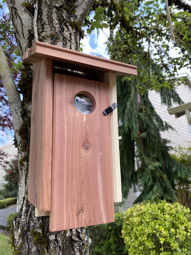
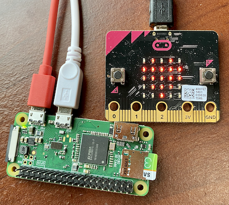
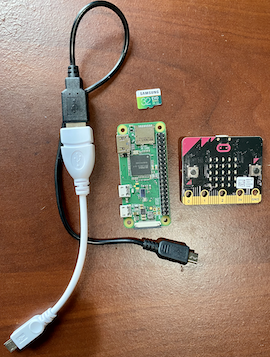
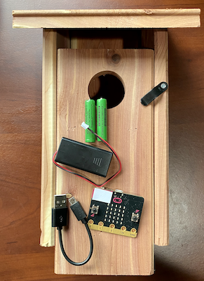
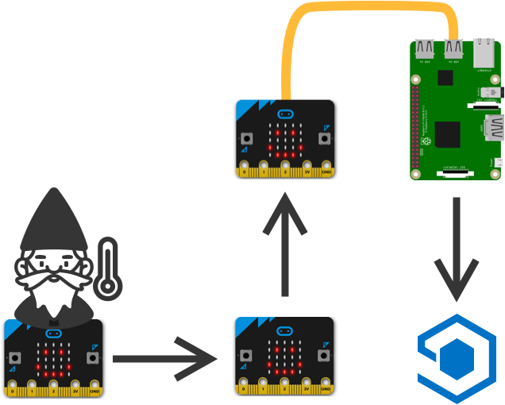

# Smart Garden Ornaments

*Ever wanted to track things happening in your garden and neighborhood using smart garden ornaments? Now you can using BBC micro:bits and a cloud-based IoT service.*

This is a fun week long project for those who want to take their first steps into the world of the Internet of Things (IoT) using devices that are popular with kids, and tools that make programming accessible to young developers. You'll use a Raspberry Pi along with some [BBC micro:bits](https://microbit.org) and any garden ornaments you have to hand to build a smart neighborhood, gathering data such as temperature and noise levels and displaying it in the cloud using [Azure IoT Central](https://azure.microsoft.com/services/iot-central/?WT.mc_id=julyot-github-jabenn).

This is great for families, groups of friends, or even in the classroom - gathering data around your school.

## How it works

Each smart garden ornament is based around a [BBC micro:bit](https://microbit.org), programmed using [Microsoft MakeCode](https://microbit.org/code/). These micro:bits sit inside whatever ornament you have, such as a bird box or garden gnome, and gather data about the outside world - also know as telemetry. This data can come from the built-in temperature sensor, or external sensors such as microphones, proximity senors or soil moisture sensors. These micro:bits will then send this data to other micro:bits via the built-in radio. Each micro:bit will forward on the message just like passing notes in class until it reaches a 'hub' micro:bit connected to a Raspberry Pi. This will then send the message on to the cloud to plot on a chart.

This project is not limited to one household - if you have neighbors they can also have smart garden ornaments as long as they are positioned close enough for the micro:bits to talk to each other. If you want to share data between households that are further apart, you can do this by using multiple hubs all connected to the same cloud service.

## What you'll need

### Coding skills

Although this guide tries to be as easy to use as possible, you will still need some technology skills. The Pi-based hub should be built by someone confident setting up a Raspberry Pi and have a basic understanding of coding with Python. The micro:bits should be programmed by someone confident programming with block-based coding.

The following icons are used to indicate if a section covers the Azure IoT Central, using the Raspberry Pi or the micro:bit:

| Icon | Description |
| ---- | ----------- |
|  | Azure IoT Central - will need someone with an Azure account|
|  | Raspberry Pi - will need someone confident setting up and programming a Raspberry Pi |
| | micro:bit - will need someone confident using block based programming on a BBC micro:bit |

If you have never set up a Pi before, you can find some great guides on the [Raspberry Pi Help site](https://www.raspberrypi.org/help/).

To learn mode about coding a micro:bit with Microsoft MakeCode, check out all the tutorials at [makecode.microbit.org](https://makecode.microbit.org).

### The Hub

For the 'hub' that allows your micro:bits to connect to the cloud, you'll need the following:

* A Raspberry Pi running Raspberry Pi OS or Raspberry Pi OS Lite. Any Pi will do that has internet connectivity, even the Pi Zero W (but not the base Pi Zero without WiFi).

* An SD card for the Pi, at least 8GB in size

* A BBC micro:bit

* An appropriate USB cable to connect the micro:bit to the Pi. For example if you are using a Pi 3 or 4 you'll need a USB to micro USB cable, if you are using a Pi Zero you'll need a micro USB to micro USB cable or an adapter.

* A USB power supply for the Pi. For the Pi 4 this needs to be USB-C, for other Pis this needs to be micro USB.

* An Azure subscription. Instructions will be provided on how to set this up in the first days project, and you'll either need to be a student over the age of 18 in higher education to sign up for a student account, or have access to a credit card to sign up for a free account.

    > If you sign up for a free account, your credit card will **NOT** be charged, it is just needed for verification.

### Smart garden ornaments

For each smart garden ornament you'll need the following:

* A BBC micro:bit

* A battery pack for the micro:bit, along with batteries. To keep the micro:bits running as long as possible, use a 2xAA battery pack, with AA alkaline batteries. Rechargeable batteries are not recommended as they provide a lower voltage. You can read more recommendations on powering the micro:bit in the [micro:bit support docs](https://support.microbit.org/support/solutions/articles/19000013982-connecting-a-power-supply-to-the-micro-bit).

    > Although you can use AAA batteries, they don't last anywhere near as long, so to gather data over longer periods to time use AA batteries. You should be able to gather data for about a week on one pair of AA batteries

* A garden ornament that can house the micro:bit and keep it dry in the event of rain. This could be a bird box, a garden gnome, fairy house, anything that is outdoor safe and has space to put the micro:bit and battery pack inside.

* Blank stickers to put labels on the micro:bits

* A USB cable that can connect to your computer to program the micro:bit

The micro:bits have a temperature sensor built in, so if you are just tracking temperature this is all you'll need. If you want to track other things then you'll need different sensors. Some need to be purchased as a sensor (such as a microphone to track noise levels or a proximity sensor), others such as a soil moisture sensor can be made yourself. This project will cover the following sensors:

* Temperature sensor
* Light sensor
* Home made soil moisture sensor

> If you want to use other sensors, check out the great kits from places like [SparkFun](https://learn.sparkfun.com/tutorials/sparkfun-inventors-kit-for-microbit-experiment-guide/experiment-7-reading-the-temperature-sensor) and [Kitronik](https://kitronik.co.uk/collections/microbit-accessories).

## Cost

The main cost to this project is the hardware. The project uses hardware that combines relatively low cost with ease of use - cheaper parts could be used with an added complexity.

The cloud service used may come with a small cost. It is free for the first 2 devices used, so if you want to use more smart ornaments then your Azure account will be billed. If you have signed up for a student or free account this can come from the credit you are given on sign up leading to no actual cost. The cost at the time of writing is US$0.70 per additional device per month. You can read more details on pricing on the [Azure IoT Central pricing page](https://azure.microsoft.com/pricing/details/iot-central/?WT.mc_id=julyot-github-jabenn).

## How the project works

If you just want to get everything up and running, you can skip this part and dive into the setup.

The basic architecture is:

* A micro:bit in a smart garden ornament reads a value such as temperature
* This value, along with an ID, is sent as a message in coded form over the radio to any device that is listening
* If a device picks up a message from another device, it re-sends it over the radio (with checks to make sure it only re-sends a message once)
* The hub micro:bit connected to the Pi listens for messages from any device, and when detected sends them over the serial port to the Pi
* The Pi listens on the serial port for messages. When it gets one it sends it to IoT Central, pretending to be the micro:bit by having multiple connections to IoT Central as using different device IDs.

If you want to understand more about the architecture and how the code works, check out the following:

* [How telemetry is sent from a micro:bit to IoT Central](./architecture-guides/how-telemetry-gets-to-iot-central.md)
* [How the mesh network works](./architecture-guides/how-the-mesh-network-works.md)
* [Walkthrough of the Hub code](./architecture-guides/hub-code-walkthrough.md)
* [Walkthrough of the device code](./architecture-guides/device-code-walkthrough.md)

## How this guide is structured

This guide is broken down into a number of days. For each day the project should take no more than about an hour and adds another part to the finished project. Each day will contain multiple parts, labelled as either beginner or advanced. The advanced parts should be done by someone with some experience, the beginner parts are ideal for those just getting started with block based programming. Older kids with some programming experience may be able to complete the entire project, but will require an adult to set up the Azure resources as these may require a credit card and require a sign up from someone over the age of 18.

Follow the links below to access the steps for each day:

* [Day 1 - setup the cloud services](./days/1-setup.md)
* [Day 2 - connect to the cloud](./days/2-connect.md)
* [Day 3 - build a sensor mesh network to track temperatures](./days/3-build-mesh.md)
* [Day 4 - build your first smart garden ornament](./days/4-build-garden-ornament.md)
* [Day 5 - add additional sensors](./days/5-add-more-sensors.md)
* [Additional ideas](./additional-ideas/)
  * [Add multiple hubs so more households can get involved](./additional-ideas/add-multiple-hubs.md)
  * [Add rules to get alerts when a sensor value is in a given range](./additional-ideas/add-rules.md)

All the code you need for the Pi is in the [`pi-hub`](./pi-hub/) folder. The code for the micro:bit portions is in separate GitHub repos that can be imported into MakeCode. The code for the micro:bit Hub is at [github.com/jimbobbennett/smart-garden-ornaments-microbit-hub](https://github.com/jimbobbennett/smart-garden-ornaments-microbit-hub), and the device code is available at [github.com/jimbobbennett/smart-garden-ornaments-microbit-device](https://github.com/jimbobbennett/smart-garden-ornaments-microbit-device).

As new concepts are covered (such as setting up IoT Central, or using new blocks in MakeCode), full descriptions are given with detailed pictures. The next time the same concept is covered, there will be less pictures and description.

## Contributing to this project

We'd **LOVE** you to contribute to this project! If you find mistakes in this guide please raise an issue or a PR. If you have additional ideas for ways to extend this project, or want to add instructions for more sensors or different ornaments please fork this repo and add them to the [Additional ideas](./additional-ideas/) section in a PR. We'd also love it if you want to share your stories - how did you set this up, what ornaments did you use, what data did you gather. Please fork the repo raise a PR to add these to the [Stories](./stories/) section. All contributions must follow our code of conduct.

This project has adopted the [Microsoft Open Source Code of Conduct](https://opensource.microsoft.com/codeofconduct/?WT.mc_id=julyot-github-jabenn). For more information see the [Code of Conduct FAQ](https://opensource.microsoft.com/codeofconduct/faq/?WT.mc_id=julyot-github-jabenn) or contact [opencode@microsoft.com](mailto:opencode@microsoft.com) with any additional questions or comments.

## Learn more, get certified

If you want to learn more about Azure IoT Services, then check out the following:

* [IoT learning paths on Microsoft Learn](https://docs.microsoft.com/learn/browse/?term=IOT&WT.mc_id=julyot-github-jabenn)
* [The IoT show on Channel9](https://channel9.msdn.com/Shows/Internet-of-Things-Show/?WT.mc_id=julyot-github-jabenn)

Once you have upskilled as an IoT developer, why not get certified with our upcoming AZ-220 Azure IoT Developer certification. Check out the details on our [certification page](https://docs.microsoft.com/learn/certifications/azure-iot-developer-specialty?WT.mc_id=julyot-github-jabenn)
