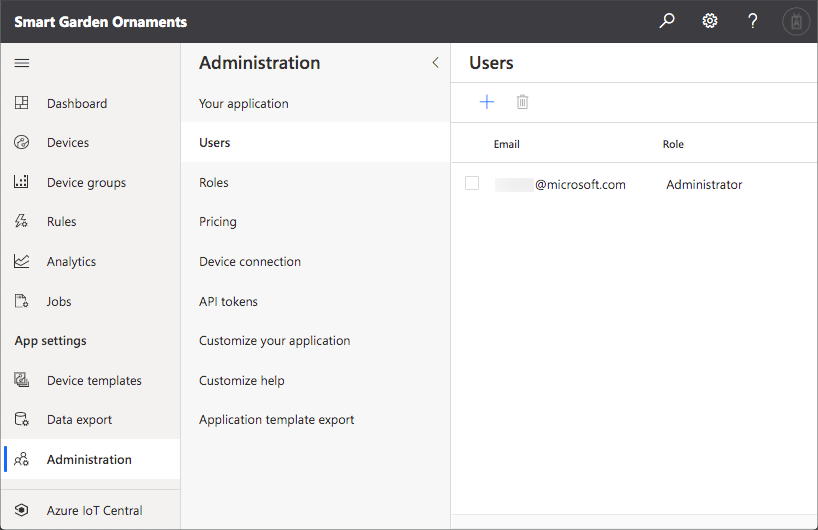

# Add multiple hubs

By adding multiple Hubs, you can add more smart garden ornaments to your project without having to have them all close to a single hub. This is great for a school project where multiple families are gathering data, or a project with your family or friends where you are not living next to each other.

## Add a new Hub

To have data from multiple Hubs on the same IoT Central Dashboard, you need to use the same IoT Central credentials for all the different Hubs. Create the Hub as before, using the same IoT Central Scope ID and Primary Key.

When you program the smart garden ornaments, ensure the new Hub has the correct mappings to the relevant device IDs.

## Give access to the Dashboard

Once you have data coming from multiple Hubs, it's time to share the data with everyone who is helping to send data in. IoT Central allows you to define roles for what users can do in the system, and assign those roles to different people.

You can configure roles and users from the **Administration** side bar menu item in IoT Central.

Add any users who you want to give access to. They will be sent an email detailing how to get signed up. Make sure you give them the appropriate permissions, such as just viewing the data, or complete control if you want them to be able to add new telemetry types.

You can read more on user and role configuration in the [IoT Central documentation](https://docs.microsoft.com/azure/iot-central/core/howto-manage-users-roles?WT.mc_id=julyot-github-jabenn).
