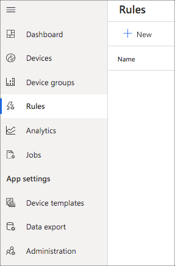
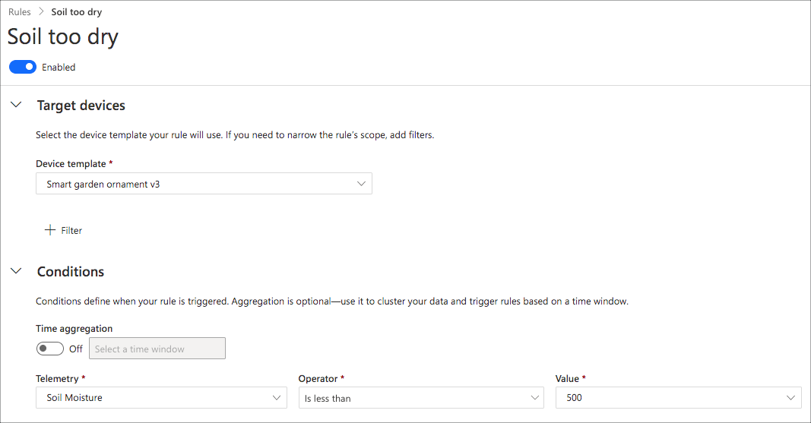
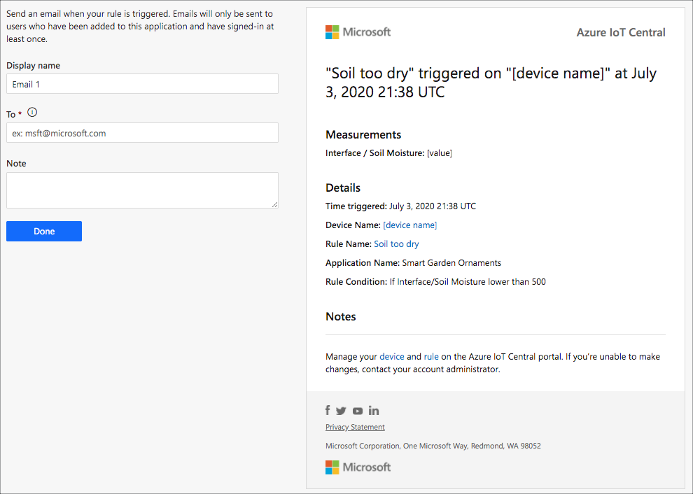

# Add rules

In IoT Central you can set up rules - events that are triggered when something happens. For example, you can set up a rule to send you an email when a soil moisture sensor value gets too low so that you know to water your plants.

1. To configure rules, select **Rules** from the side bar menu.

    

1. Select **+New Rule** and configure the rule. You'll need to give it a name, select the relevant device template and a condition for the rule. You can also aggregate data over a time window.

    

1. Select one or more actions to run when the rule is triggered. This can be an email, a call to a webhook (so you can link it to Twilio, Slack, Teams etc.), or run an Azure logic app.

    

1. Select **Save** when you are done.
