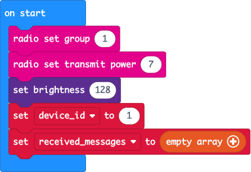
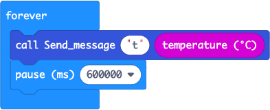
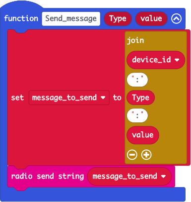
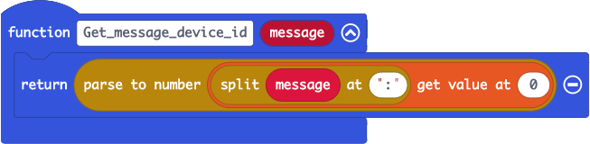
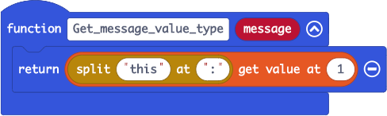
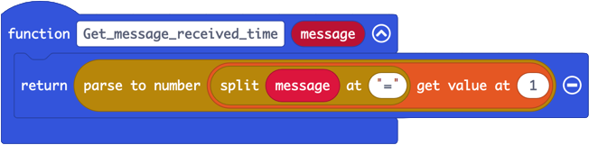
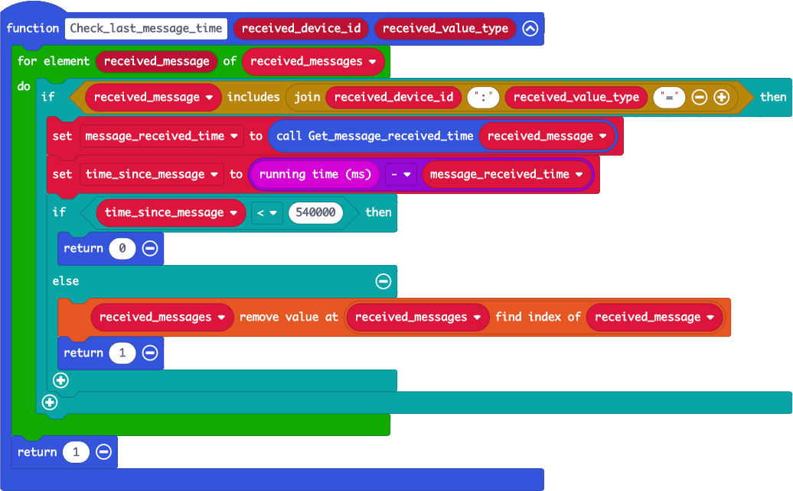

# Smart garden ornament code walkthrough

The smart garden ornament is made from a micro:bit running some block-based code. This walkthrough explains the code.

## micro:bit code

The micro:bit code has two jobs. Firstly, it is designed to listen to sensor data and send this to the Hub over the radio. Secondly it acts as a node in a mesh network, forwarding on messages from other micro:bits to ensure they all reach the Hub, even if a device is too far away for a direct connection.

> You can read more about how the mesh works in the [How the mesh network works architecture guide](./how-the-mesh-network-works.md)

### on start

The `on start` block is run once when the device is first powered up. It starts by configuring the radio - setting the group to 1 and setting the power as high as possible. All micro:bits on the same radio group can message each other, but won't receive messages from other radio groups. Power is a scale from 0-7, with 7 being the highest power. Over clear air, a power of 7 means radio signals can reach up to 70 metres!

> The higher the radio power, the faster the batteries will lose power. If you know a device is going to be close to another then you can reduce the power to save battery life.

Next the brightness is set to 128. This is the brightness of the LEDs and is on a scale from 0-255. Reducing the brightness will help with the battery life.

The `device_id` is then set. This is not the device ID used by IoT Central, but a code that is mapped by the Hub. Radio messages sent and received by micro:bits are limited to 19 characters, so to keep the message size down, single or double digit device IDs can be used instead of the full device ID. The Hub will then map these. This `device_id` value needs to be changed for each micro:bit that is programmed - this is the only bit of code that needs to be updated when programming a micro:bit.

Finally the `received_messages` variable is initialized to an empty array. This is used by the mesh networking code, and needs to be an array. Setting it here to an empty array means other code that expects it to be an array will work.

### forever

The `forever` block is code that is run forever! Every time the block finished, it is run again, and again, and again, until the micro:bit is powered off.

The code in this block sends messages with sensor data. The block shown here uses the micro:bits in-built temperature sensor to get the temperature in degrees celsius and sends it to the `Send_message` function with a value type of `t`. These value types are codes to indicate what type of data is being sent and these are mapped to the full names in the Hub. Like with the device IDs, this is to help keep the messages as small as possible.

Messages don't need to be sent very often - this is not real time monitoring, and sending only a few messages a day keeps the cost down! To throttle messages, the `forever` loop pauses for 600,000 ms, or 10 minutes, before sending data again.

### Send message

The `Send_message` block is a function that sends a message over the radio. This block takes two parameters - the `Type` of data to send, and the `value` to send.

A variable is set with this data, along with the device ID in the format `device_id:type:value`, for example for device 1 sending a temperature of 25°C, this would be `1:t:25.0`. This variable is then sent over the radio.

### Get message device ID

The mesh network works by listening for messages and forwarding them on. Not every message gets forwarded - to avoid the risk of messages bouncing back and forth, messages from a device for a particular value type are checked to see if they have been received recently, and if so they are not forwarded. The device that sent the messages is also checked - a message could go from device 1 to device 2, then back to 1. Messages that came from a particular device will never need to be sent on by the same device.

The `Get_message_device_id` function block takes a `message` and extracts the device ID part. Messages are in the format `device_id:type:value`, so can be split by the `:` character into an array of three parts - the device ID, the data type, and the value. After splitting, the first item in the array (the value at position 0 as arrays start at 0) is the device ID, so this is returned.

For example, the message `1:t:25.0` gets split into an array of three values - `1`, `t`, `25.0`. The first value, `1`, is the device ID.

### Get message value type

As described above, messages for a particular device ID and value type should not be forwarded on if they were received recently to stop messages bouncing back and forth. The `Get_message_value_type` function block gets the value type of a message in the same was as the `Get_message_device_id` function block. The second item in the array (at postition 1 as array positions start at 0) when splitting the message by `:` is the value type.

For example, the message `1:t:25.0` gets split into an array of three values - `1`, `t`, `25.0`. The second value, `t`, is the value type.

### on radio received

The `on radio received` block is run by the micro:bit every time it receives a message over the radio from a device on the same radio group. This block then needs to forward the message on over the mesh, but needs to ensure that the mesh isn't flooded by the same message bouncing back and forth.

Imagine the scenario of two micro:bits - 1 and 2. 1 sends a message with temperature data, 2 receives it and re-sends it, where it is picked up again by 1 and re-sent, received again by 2 and re-sent, and so on forever. This situation needs to be avoided, so this function needs to only send on messages once, not repeatedly.

The rules in this block are:

* Don't resend messages from the same device ID - if 1 sends, then 2 re-sends,1 should detect that the message came from itself and not resend
* If a message is received, track the device ID, value type and time received before re-sending. If another message for the same device and value type is received soon after then it's the same message bouncing around and doesn't need to be re-sent. Messages are sent every 10 minutes, so anything more often than that is a message bouncing around.

The block starts by getting the device ID and value type from the message using the `Get_message_device_id` and `Get_message_value_type` function blocks.

The message device ID is check against the micro:bits device ID. The rest of the block logic is only run if they are different, so the message came from a different micro:bit originally.

Next the time is checked. The `received_messages` array is checked to see the last time a message was received for the same device ID and value type. The rest of the block is only run if this time was long enough ago that this is a new message.

An entry is added to the `received_messages` array for the device ID and value type against the current micro:bit time. micro:bits don't have a wall clock, so don't know the actual time. Instead they have a `running time` - the time since the device was last started. This is good enough to use as the devices don't care about the actual times, just the elapsed time since the message was last received. Data is stored in this array in the format `device id:value type=time`. For example, if a message with temperature data from device 2 was received 16,000 ms after the device was started, the entry would be `2:t=16000`

Finally, the message is sent over the radio.

### Get message received time

The `received_messages` array tracks the messages received to stop messages bouncing back and forth for ever. The `Get_message_received_time` function block takes entries from this array and extracts the time part.

Data is stored in this array in the format `device id:value type=time`, so this function splits these entries using the `=` character. This split creates an array of 2 items, and the second item (index of 1) is the time. This is converted from a string to an integer and returned.

For example, if a message with temperature data from device 2 was received 16,000 ms after the device was started, the entry would be `2:t=16000`. This would be split to give an array of two items - `2:t`, `16000`. The second value (index 1) is `16000`, this is converted to the number 16,000 and returned.

### Check last message time

The `Check_last_message_time` block is responsible for checking the last time a message for a device ID and value type was received, and if it is within 9 minutes, the message should not be forwarded on. This function returns `0` if the message should not be forwarded on, and `1` if it should.

This function will loop through all the messages received already in the `received_messages` array to look for an entry for the device ID and value type passed in as parameters. It does this by building the first part of the `received_messages` array entry by joining the device ID, a `:`, the value type and an `=`. For example, if the device ID is 2 and the value type is `t`, it will build `2:t=`. The function will loop through all the items in the array to find one that contains this.

If no items are found that contain the device ID and value type, a value of `1` is returned.

If one is found, the time part of the array entry is extracted using the `Get_message_received_time` function block. The difference between the current time and this time is calculated.

This difference is checked to see if it is less than 9 minutes (540,000ms). Messages are sent every 10 minutes, so identical messages less than 9 minutes apart are very likely to be ones that are bouncing around the micro:bits. If the difference is less than 9 minutes, `0` is returned to say the message should not be forwarded on. Otherwise the entry for that device ID and value type is removed from the array, and `1` is returned.
