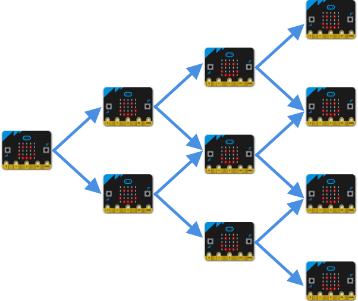
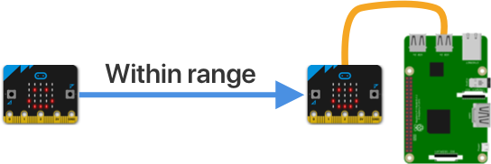
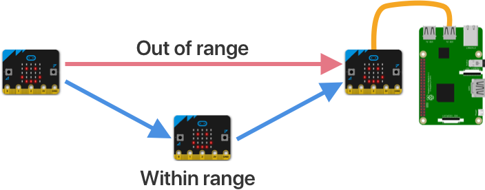

# How the mesh network works

The purpose of the mesh network is to get around the distance limitations of micro:bits. The Hub is the only connection to the internet, so to get data to the cloud a micro:bit either needs to be close enough for a radio message to reach, or needs a way to get the message forwarded on. The mesh network helps this by forwarding messages across the mesh to ensure they reach the Hub - assuming at least one micro:bit is close enough then all micro:bits can get messages to the cloud.

> You can read more about mesh networking in the [mesh networking article on Wikipedia](https://en.wikipedia.org/wiki/Mesh_networking). The mesh network here uses a [controlled flooding routing algorithm](https://en.wikipedia.org/wiki/Flooding_(computer_networking)) that uses the time messages were sent to control flooding. Using time stamps helps with the limitations on message sizes, and can be done as the messages are only sent with well defined pauses

## Message flow through the mesh

Messages are sent by micro:bits containing telemetry data over the radio. Each micro:bit will then listen for messages from other devices and forward them on. Radio messages are broadcast messages, meaning they go from one to many, then are resent from one to many and so on. A message will spread from a single point and keep spreading throughout the entire network, touching every single micro:bit.

This may seem like overkill, and there are mesh network routing algorithms that can find the shortest path, healing if paths are broken. These algorithms add complexity, so sending messages to every node is easier to implement, especially for beginner programmers getting used to block-based programming.

Eventually one or more messages will reach the Hub and get sent to the cloud.

You can watch this happen by lining up a set of micro:bits. If you reset one, it will send a message as soon as it starts, indicated by a duck icon. You'll then see the other micro:bits show a small diamond to show they have received the message, followed by a tick to show it has been resent.

To see the full effect, you will need a couple of assistants.

1. Position one micro:bit too far from the Hub for a message to be received

1. Get one assistant to watch the micro:bit attached to the Hub

1. Reset the micro:bit to send a message

1. You'll see the duck to show the message has been sent, but your assistant will see nothing on the Hub - there will be no corresponding duck on the Hub micro:bit

1. Get another assistant to position themselves between the micro:bit and the Hub with a micro:bit that is turned on

1. Reset the first micro:bit. You will see a duck to show the message has been sent.

1. The assistant in the middle will see a diamond, followed by a tick to show the message has been detected and forwarded on

1. The assistant by the Hub will see a duck to show the message has been received

This is a fun experiment to repeat with as many micro:bits and assistants as you can find. It's also great in a classroom - see how far across a school you can get messages using a mesh.

## Flood control

Flood control is about stopping messages continuously bouncing forwards and backwards around the mesh.

Consider the following scenario:

* micro:bit 1 sends a message
* micro:bit 2 receives it and sends it out again
* micro:bit 1 receives it and sends it out again
* micro:bit 2 receives it and sends it out again

And so on forever. Scale this up to many micro:bits and the mesh will only ever bounce a single message around forever.

Flood control is all about ensuring messages can't bounce forever. It is implemented in 2 places - the micro:bits themselves and the Hub.

The flood control method here is relatively simple compared to more robust, commercial algorithms - it relies on the fact that telemetry messages are only send once every 10 minutes.

### Flood control in the micro:bit

Each micro:bit can receive messages many times - either messages from other micro:bits propagating around the mesh, or even messages from itself being sent back. To avoid flooding the mesh, the messages are only forwarded on in certain circumstances:

* Any message from the device itself is ignored
* Any message for a device ID and value type is only sent once every 9 minutes

The way this is enforced is:

* Each message has the sending devices device ID, as well as the type of value that is being sent
* If the device ID is the same as the current device, the message is ignored
* If the device ID is different, a check is made to see when a message for the same device ID and value type was last forwarded on
  * If the last time was less than 9 minutes ago, the message is ignored. Messages are only sent every 10 minutes, so anything less than this is a message bouncing around the network
  * If the last time is more than 9 minutes ago, the message is forwarded on, and the device time is stored

There isn't a clock as such in a micro:bit - you can't get the current real world time. Instead each micro:bit has a running time, and this is the number of milliseconds that the micro:bit has been running since it was last powered up. This is fine to use to check message times as the mesh doesn't care what the actual time was that the message was sent, just if it's within 9 minutes of *now*, with *now* being the number of seconds since the micro:bit was powered on.

### Flood control in the Hub

The Hub can receive a message many times - once for each micro:bit that is close enough to send the message originally, or re-send a message across the mesh. Seeing as a micro:bit will only send a message every 10 minutes, the Hub stores a list of messages and when they were last received. If a message was received, and an identical message was received within a few minutes, it can be ignored.

Messages a re tracked by the sending device ID and the type of value that was sent. This is keyed against the actual time of day to determine if a message was received within the last few minutes.

For example, a setup with 3 micro:bits that can reach the Hub:

* micro:bit 1 sends temperature telemetry
* micro:bit 2 receives this and sends it on
* micro:bit 3 receives this and sends it on
* The hub detects the message from micro:bit 1
  * The last time a temperature message from 1 was sent is checked
  * The time is more than a few minutes ago so the message is sent to IoT Central
  * The current time is stored against temperature messages from device 1
* The hub detects the message from micro:bit 2 1 second later
  * The last time a temperature message from 1 was sent is checked
  * The time is only one second since the last message, so the message is ignored
* The hub detects the message from micro:bit 3 1 second later
  * The last time a temperature message from 1 was sent is checked
  * The time is only one second since the last message, so the message is ignored
* micro:bit 1 sends light telemetry
* The hub detects the message from micro:bit 1 a few seconds later
  * The last time a light message from 1 was sent is checked
  * The time is more than a few minutes ago so the message is sent to IoT Central - although a temperature message was received more recently, this is for light
  * The current time is stored against light messages from device 1

## Growing the mesh

To grow the mesh, a new micro:bit needs only to be close enough to one other device to get a message onto the mesh, after that it will propagate to the Hub. To test if a device is close enough, get an assistant to monitor the closest devices, and reset the new one. If they see the diamond followed by tick, the message ot through. If not, the device needs to move closer.

If it's not possible to move a specific device closer, for example it is measuring something in a specific location, then you can help it to connect by adding another micro:bit to the mesh positioned between the other devices. You don't even need to register this in IoT Central, it can exist purely to forward messages on.

