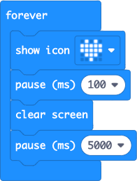
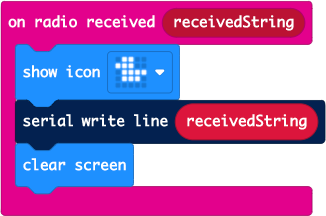

# Hub code walkthrough

The Hub is made from a Raspberry Pi running Python code, along with a micro:bit running some block-based code. This walkthrough explains the code.

## micro:bit code

The micro:bit runs a very small piece of code to listen for messages over the radio and send them to the serial port.

### on start


The `on start` block is run once, when the device starts up. This contains a single block that sets the radio group to 1. micro:bits can talk to each other over a radio, and they can use different frequencies to avoid messages going to the wrong place if you have multiple micro:bits sending messages to each other. In this case, the radio group is set to 1, and this will also be done on the garden ornament micro:bits, so that they all can communicate on the same frequency.

### forever



The code in this block is for display only, so that you can see that the micro:bit is doing something. It uses a `show icon` block to show a heart on the LED display, then clears the display and pauses for 5 seconds. This will show a pulsing heartbeat visible every 5 seconds.

### on radio received



This block contains the important code. `on radio received` is run every time the micro:bit receives a message over the radio. The contents of the message is passed to this block in the `receivedString` parameter. This code shows a duck icon on the LED to indicate a message was received, then writes the message to the USB serial connection, before clearing the duck off the screen. Quack!

## Raspberry Pi code

The Pi code is responsible for taking the messages sent over the serial cable, decoding them into a form that IoT Central can understand, and sending them to IoT Central. THis code is made of 2 Python files - [`mappings.py`](../pi-hub/mappings.py) and [`app.py`](../pi-hub/app.py)

> The code shown below is condensed, removing the comments and print statements from the original files to save space. The comments are not needed here as the code is being explained, and the print statements are only needed when running the code to see what is happening.

### mappings.py

The [`mappings.py`](../pi-hub/mappings.py) file contains mappings to decode the data sent from the micro:bit. The micro:bit can only send messages of up to 19 characters over the radio, and this means it has to use codes to reduce the message size by sending the device ID and the type of telemetry data as only one or two characters.

If you want to send data for a device in IoT Central with the ID of `office-window-birdbox`, just putting the ID in the message would use 21 characters, over the limit already. Instead the device can send anID such as `1`, and the Pi code can map this to the full device ID.

The same applies for the type of data. If you are sending a temperature value, then sending the full word `Temperature` will use 11 of the available 19 characters. Instead the single character `t` can be sent, and this can be mapped to `Temperature`, the name of the telemetry data that IoT Central is expecting.

These mappings are defined as two dictionaries in this file:

```python
devices = {
    "1" : "device-1",
}

value_types = {
    "t" : "Temperature",
}
```

The `devices` dictionary is used to map from the ID sent by the micro:bit to the IoT Central device ID. The `value_types` dictionary is used to map the data type values to the telemetry fields that IoT Central is expecting.

### app.py

The [`app.py`](../pi-hub/app.py) file contains the core app code. This code listens for messages from the micro:bit over the serial connection. When one is detected it queues it up for asynchronous processing. This asynchronous processing will decode the data using the mappings file, connect to IoT Central, creating the device in IoT Central if necessary, then send the data.

Normally when coding IoT devices, the code would have a single connection to IoT Central - one device to one connection. This is slightly different as the Pi is acting as a Hub to route messages from many other devices. Instead of a single connection that represents one device, it has multiple connections, one per micro:bit that will send messages.

```python
load_dotenv()
ID_SCOPE = os.getenv('ID_SCOPE')
IOT_CENTRAL_KEY = os.getenv('IOT_CENTRAL_KEY')
```

This code uses the `python-dotenv` package to load some secrets from a `.env` file. The `ID_SCOPE` is a code used by IoT Central to identify the application that is being connected to. The `IOT_CENTRAL_KEY` is the primary shared access signature key used to authenticate with IoT Central. This key has enough permissions to create new devices in IoT Central.

```python
def compute_derived_symmetric_key(device_id):
    return base64.b64encode(hmac.new(base64.b64decode(IOT_CENTRAL_KEY), msg=device_id.encode("utf8"), digestmod=hashlib.sha256).digest())
```

The `compute_derived_symmetric_key` function computes a device-specific authentication key using the primary IoT Central key and the device ID. This is needed to authenticate as the different devices to send data. Each micro:bit will need a different key to authenticate, as they are represented by different devices in IoT Central. These device specific keys are made of a hash of the primary key and the device ID.

```python
async def register_device(device_id, device_key):
    provisioning_device_client = ProvisioningDeviceClient.create_from_symmetric_key(
        provisioning_host='global.azure-devices-provisioning.net',
        registration_id=device_id,
        id_scope=ID_SCOPE,
        symmetric_key=device_key)

    return await provisioning_device_client.register()
```

The `register_device` function will register the device in IoT Central. The `ProvisioningDeviceClient` uses the Azure IoT Device Provisioning Service to provision the device inside IoT Central - essentially creating the device. This uses the device-specific key, the device ID and the ID scope of the IoT Central application to identify which IoT Central application to create the device in. This is the same as creating the device with the given ID inside the IoT Cental app. You can't set the device name, or the device template here, this has to be configured in IoT Central. The device name defaults to the same as the device ID, and there device isn't assigned to a template.

```python
async def get_or_create_device_client(device_id, device_clients):
    if device_id in device_clients:
        return device_clients[device_id]

    device_key = compute_derived_symmetricKey(device_id).decode("ascii")

    results = await register_device(device_id, device_key)
    registration_result = results[0]

    conn_str='HostName=' + registration_result.registration_state.assigned_hub + \
                ';DeviceId=' + device_id + \
                ';SharedAccessKey=' + device_key

    device_client = IoTHubDeviceClient.create_from_connection_string(conn_str)

    device_clients[device_id] = device_client

    return device_client
```

To connect to IoT Central from Python code, you need a `IoTHubDeviceClient` object. This wraps the connection for a single device. For the Hub to act like multiple devices, it needs one `IoTHubDeviceClient` per device that is sending data, each one connecting as a different device. Rather than create the connection each time a message is received, it makes sense to cache the connections. The `get_or_create_device_client` function returns the device client for the device.

The `device_clients` dictionary maps device IDs to device clients. This code starts by checking this dictionary to see if there is an existing device client for the device ID - if so it is returned. If there isn't an existing device client, then one is created. First the device specific key is created, then the device is registered with the device provisioning service. This registration returns a result that contains details of the underlying IoT Hub that the IoT Central device should use. IoT Central is an IoT software as a service platform that sits on top of IoT Hub, which is a pipeline for IoT data going from devices to the cloud, and vice versa. This IoT Hub is converted to a connection string using the device id and key, and this is used to make the connection in the device client. This connected device client is then cached in the dictionary and returned.

```python
def build_telemetry(value_type, value):
    telemetry_value_name = value_types[value_type]
    telemetry_value = float(value)
    return json.dumps({ telemetry_value_name : telemetry_value })
```

Telemetry needs to be sent to IoT Central as a JSON document, with key/value pairs for the telemetry types to values using the names specified in the IoT Central device templates. The `build_telemetry` function will build this JSON. The `value_type` that comes in is the short code sent from the micro:bit, and this is looked up in the `value_types` dictionary in the `mappings.py` file to find the name in IoT Central. For example, `value_type` could be `"t"`, and this will be mapped to `"Temperature"`. The value is converted to a `float` because the data read from the micro:bit via the serial port will always be text, so this string data needs to be converted to a number. These values are added to a dictionary, which is converted to a string representation as JSON. For example, if the `value_type` is `"t"` and the `value` is `"25"`, the resulting dictionary would be:

```json
{
    'Temperature': 25.0
}
```

The call to `json.dumps` will convert this to a string representation that can be sent to IoT Central - `"{'Temperature':25.0}"`.

```python
async def message_worker(queue):
    last_values = {}
    device_clients = {}
    while True:
        item = await queue.get()

        data = item.split(":")
        device_code = data[0]

        if device_code not in devices:
            continue

        device_id = devices[device_code]
        value_type = data[1]
        value = data[2]

        value_key = device_id + ":" + value_type
        if value_key in last_values:
            if time.time() < (last_values[value_key] + 60):
                print("Telemetry received too soon after a similar value, ignoring")
                continue

        device = await get_or_create_device_client(device_id, device_clients)

        telemetry = build_telemetry(value_type, value)
        await device.send_message(telemetry)

        last_values[value_key] = time.time()
```

The `message_worker` function listens to messages on a queue. Whenever messages are received from the micro:bit they are put on a queue, and this function takes them off and processes it. This is in an infinite loop - it will wait for a message on the queue, process it, then loop, wait for messages on the queue, process it, and so on until the app is closed.

Once a message is taken from the queue it is split into 3 parts using the `:` separator. Messages from the micro:bit are colon separated and of the format `<device_id>:<value_type>:<value>`, for example a temperature value of 25.0°C from device 1, the message would be `1:t:25.0`. Once split, the first value is mapped using the `devices` dictionary in the `mappings.py` file to get the IoT Central device ID. If the device doesn't exist in the mappings file the message is ignored - this is to stop the program crashing if messages from a new device are detected before the device mapping is set up.

If the device is mapped, the IoT Central device ID, value type and value are extracted. A check is done to see if we received a similar message before. The `last_values` dictionary stores the last time a message for a device ID and value type was received. If this was less than 60 seconds ago, the message is ignored. This is because the mesh network will send a message multiple times - once for the micro:bit that sent it originally if it's close enough to the Hub, and once for each micro:bit in range of the Hub that re-sent the message.

The device ID is used to get the device client, creating a new device client if necessary. The telemetry JSON document is built up from the value and the value type, and the message is sent via the device client. Finally the time is stored against the device ID and value type.

```python
async def main_loop(sio, queue):
    """The main loop - processes messages from the serial connection
    """
    while True:
        try:
            # Read from the serial port
            all_data = sio.readline().strip()

            # Only process if there is data
            if all_data != "":
                # Split into separate lines, as each message is on a separate line
                lines = all_data.split("\n")

                # Queue all the lines to be processed for sending to IoT Central
                for line in lines:
                    print("Received telemetry:", line)
                    await queue.put(line)
        except:
            pass

        # Sleep to allow everything to catch up
        await asyncio.sleep(0.5)
```

The `main_loop` function is an asynchronous function the processes messages and sends them to the queue. It consists of an infinite loop that pulls messages from the serial connection, which is passed in as the `sio` parameter.

It starts by reading from the serial port. If it gets data, this is split into individual lines and each line is added to the queue for processing by the `message_worker`.

After checking the serial port and sending the message if there is one, it sleeps for half a second to allow some processing time for other threads.

```python
async def main():
    microbit_path = "/dev/" + next(x for x in os.listdir("/dev") if x.startswith("ttyACM"))

    ser = serial.Serial(microbit_path, 115200, timeout=0.1)
    sio = io.TextIOWrapper(io.BufferedRWPair(ser, ser))

    queue = asyncio.Queue()

    # Start the different asynchronous functions
    listeners = asyncio.gather(message_worker(queue, device_clients))

    # Start the main loop
    await main_loop(sio, queue)
```

The `main` function starts the application. It starts by searching for the micro:bit. The micro:bit appears as a device in the `/dev` folder on the Raspberry Pi OS filesystem. TRhe name is different for each micro:bit, but always starts with `ttyACM`. The code firsts the first (and should be only) device that is in the `/dev` folder that starts with `ttyACM`

You can see this by running `ls /dev/ttyACM*` on the Pi:

```output
(.venv) pi@smart-hub:~/PiHub $ ls /dev/ttyACM*
/dev/ttyACM0
```

Once the device is found, a serial connection is made, and a reader is wrapped around this to read text.

Next an asynchronous queue is created. This queue will have messages put on it, and take off and processed by the `message_worker`. The `message_worker` is then launched on a background thread.

The `main_loop` is then started.

```python
asyncio.run(main())
```

This code starts running the `main` function and waits till it completes, which will be never as the `main_loop` runs forever.