# Day 1 - Setup the cloud services

> 
>
> **This entire day should be done by someone who has or can set up an Azure account**

Todays project is to set up the cloud service. This service will take data from the micro:bits via the Raspberry Pi Hub and show it on a dashboard - for example showing temperatures from different smart ornaments on a graph and showing their locations on a map.

The cloud service that will be used is [Azure IoT Central](https://azure.microsoft.com/services/iot-central/?WT.mc_id=julyot-github-jabenn), an IoT software-as-a-service platform. IoT Central allows you to configure apps - separate projects that can have one or more devices sending in data, as well as dashboard that you can use to see that data. In this case, the IoT Central app will be a project for your smart garden ornaments, connecting to your micro:bits to gather sensor data and plotting this data on a dashboard.

<!-- TODO - add dashboard screenshot -->

The steps you'll take to set this up are:

1. Set up and Azure subscription
1. Create an Azure IoT Central app
1. Define a device template in the IoT Central app
1. Add a first device in IoT Central
1. Create a dashboard to visualize the device data
1. Get some configuration values for IoT Central

## Create an Azure subscription

To use Azure services you'll need an Azure subscription. If you don't have a subscription you can sign up for free.

* If you are a student aged 18 and up and have an email address from an academic institution, you can sign up for the free Azure for Students offer at [azure.microsoft.com/free/students](https://azure.microsoft.com/free/students/?WT.mc_id=julyot-github-jabenn) without a credit card. At the time of writing this gives you $100 of credit to use over 12 months, as well as free tiers of a number of services for that 12 months. At the end of the 12 months, if you are still a student you can renew and get another $100 in credit and 12 months of free services.

* If you are not a student, you can sign up at [azure.microsoft.com/free](https://azure.microsoft.com/free/?WT.mc_id=julyot-github-jabenn). You'll need a credit card for verification purposes only, you'll not be billed unless you decide to upgrade your account to a paid offering. At the time of writing the free account will give you US$200 of free credit to spend on what you like in the first 30 days, 12 months of free services, plus a load of services that have tiers that are always free.

## Create an Azure IoT Central app

Azure IoT Central uses the term 'App' to refer to a project containing one or more devices, along with dashboards, rules, the ability to export data and other capabilities.

### Log in to IoT Central

1. Head to [apps.azureiotcentral.com](https://apps.azureiotcentral.com/?WT.mc_id=julyot-github-jabenn)

1. From the side bar menu, select **My apps**

    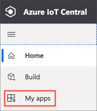

1. Log in with the account you used to set up your Azure Subscription

### Create the app

1. From the top of the page, select **+ New application**

    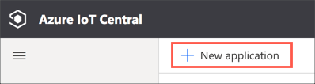

1. Select **Custom apps** from the *Featured* section

    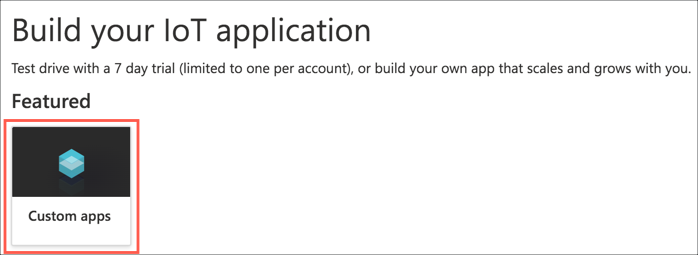

1. Fill in the application details

    1. Give the application a name, such as `Smart Garden Ornaments`

    1. Set the URL for your application. This URL needs to be unique across *all* IoT Central applications, so add something unique to it such as your name, date, anything like that. For example, the URL `smart-garden-ornaments` probably won't be available, but `jims-smart-garden-ornaments` might be available. As this will form part of the web address of the app it can't contain spaces or other special characters - you should only use numbers, letters, and hyphens.

    1. Select **Custom application** for the *Application template*

    1. Select the **Standard 1** pricing plan. This plan is free for the first two devices, with a limit of about 6-7 messages an hour per device, which should be more than enough for the kind of data you'll be collecting. More devices are US$0.40 per month per device at the time of writing.

        > There is a free tier allowing up to 5 devices. Apps created with the free tier are deleted after 7 days, so the Standard 1 tier allows you to keep your apps for as long as you need.

    1. In the *Billing info* section, select your *Directory* and *Azure Subscription*. If you only have one subscription, then there will only be one directory to select, if you have multiple (for example a work or university subscription and a personal free subscription), select the appropriate directory.

    1. Select the nearest location to you.

        > The location determines which Azure Region the app will be created in. Azure has multiple regions all around the world, and you always want to select the one closest to where your devices will be connecting from. You can read more about Azure Regions including seeing where they are in the [Azure regions documentation](https://azure.microsoft.com/global-infrastructure/regions/?WT.mc_id=julyot-github-jabenn).

    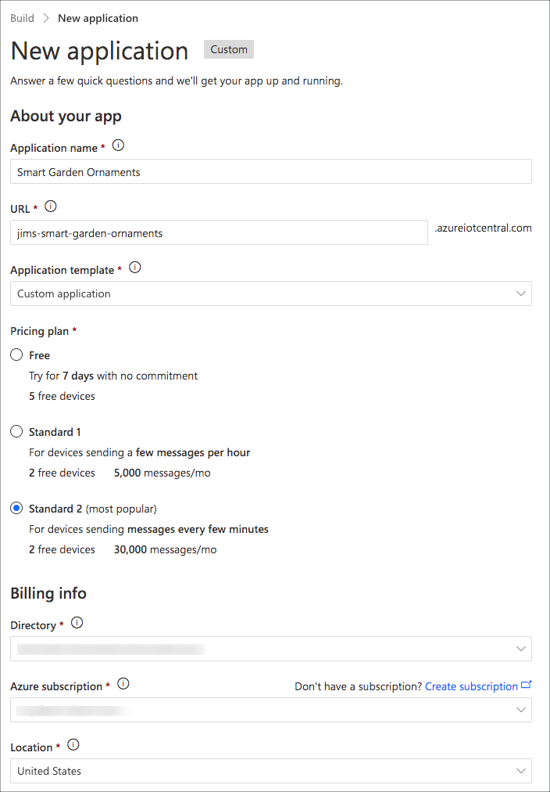

1. Once the form is filled in, select **Create** to create the IoT Central application

    

### Create a device template

Before you can send data to IoT Central, you need to tell it what data to expect and what format that data is in. This is done using device templates. Device templates describe how to interact with a certain type of device, and each IoT Central app can have multiple device templates.

Device templates allow you to define the following:

* Telemetry - this is data sent by the device and shown on IoT Central. This is transient data - so if the device is disconnected the values are lost. For example the current detected temperature.
* Properties - this is data that can be set by the device or IoT Central and is kept in sync between the two. This is non-transient data, so if a device is offline when the value is set in IoT Central, it will be retrieved next time the device is online. For example indicating if a light should be turned on.
* Commands - these are requests from IoT Central for the device to perform an action. For example in a agriculture system a command could instruct a watering system to turn on the water supply
* Cloud properties - these are values stored in IoT Central against a device, and are never sent to the device. For example the location of the device.
* Views - these are dashboards that can be created against a device to view data or send commands.

Telemetry, properties and cloud properties can have a type such as temperature, location, humidity, or speed. By setting the type, IoT Central can show this data with the right units and in the correct way, for example showing temperature data on a graph or location data on a map.

There is a small complexity to device templates - namely versioning. IoT Central is great for hobbyists and makers as it is less complex than setting up an IoT solution using many different pieces, but it is still capable of supporting professional use. To support professional users building production applications, device templates come with *capability models* that contain an interface that defines the telemetry, properties and commands that a device supports. These interfaces are versioned, meaning that you can't delete items from the interface, only add by creating a new version. That way you can't break an existing device template - imagine changing the name of a property after you've deployed a million devices sending data with the old name!

<!-- TODO - add diagram explaining this -->

To start with, the device template will have an interface to collect the temperature, and in later days you'll version this interface to add more telemetry values.

#### Create the empty device template

To create the device template, do the following:

1. From the side bar menu, select **Device templates** from the *App settings* section

    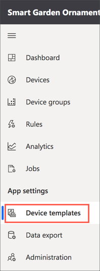

1. Select **+ New** from the menu at the top

    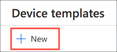

1. Select **IoT device** from the *Create a custom device template* section, then select **Customize**

    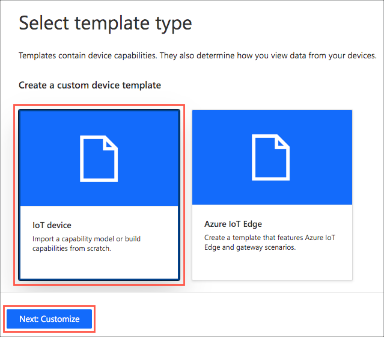

1. Name the device template `Smart garden ornament`

    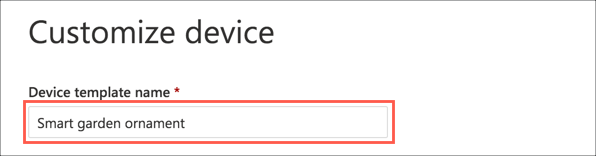

1. Select **Next: Review**

    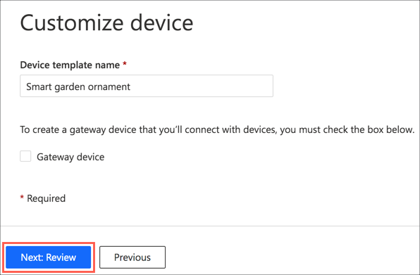

1. Review the settings, then select **Create** to create the new device template

    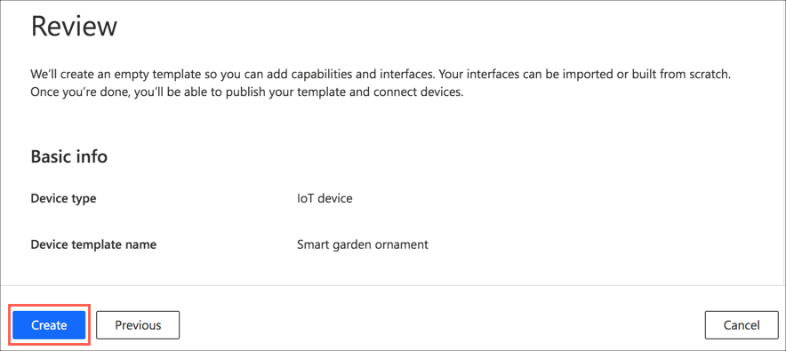

#### Add a capability model

Once the device template is created, you'll need to add a capability model. This capability model is used to define what capabilities your device has - such as what data it will send.

1. From the *Create a capability model* section, select **Custom**

    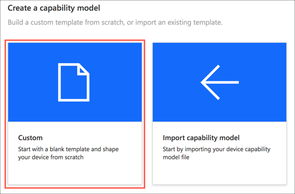

1. Select **+ Add interface**

    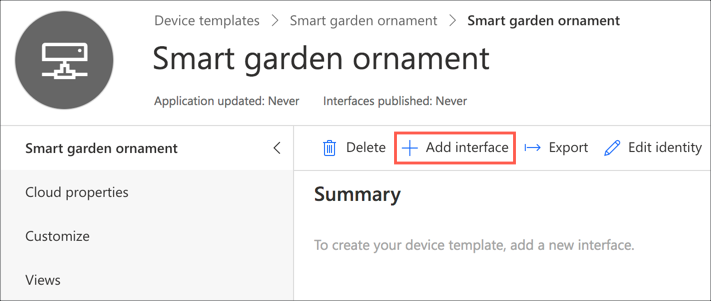

1. Select **Custom**

    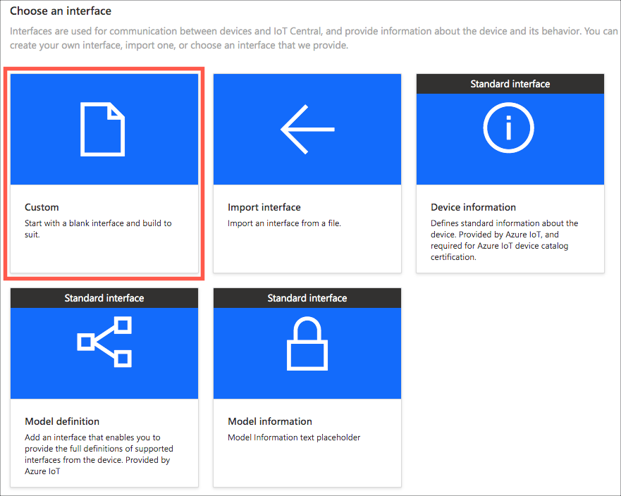

#### Add capabilities to the capability model

The device will need one *telemetry* value to start with, one *cloud property*, and two *views*. The telemetry value will be temperature and this will come from the on-board temperature sensor on the micro:bit. The cloud property will be the location of the smart garden ornament. The first view will show the temperature for that one device, the second view will allow you to set the location.

##### Add the temperature telemetry value

1. Select **+ Add capability**

    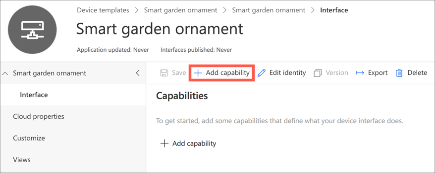

1. Enter the required values for sending temperature as telemetry:

    1. Enter `Temperature` as the *Display name*. This will set the *Name* to `Temperature`, and you can leave this as is.

    1. Leave the *Capability Type* as `Telemetry`

    1. Set the *Semantic Type* to `Temperature`

    1. Leave the *Schema* as `Double`

    1. Set the *Unit* to `°C`

    1. Leave the rest of the fields as is

    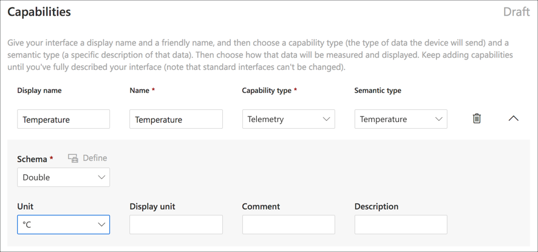

1. Select **Save** to save the capability

    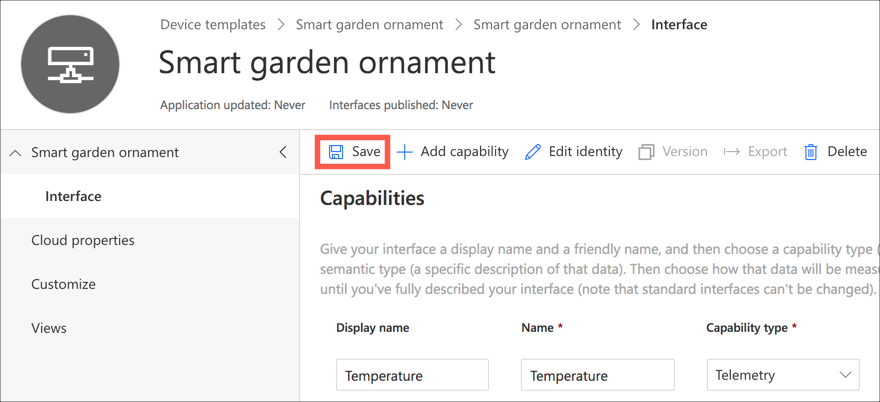

##### Add the location cloud property

1. Select **Cloud properties**

    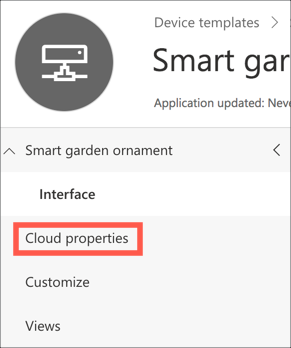

1. Select **Add cloud property**

    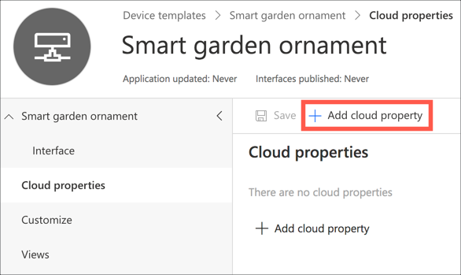

1. Enter the required value for the location cloud property:

    1. Enter `Location` as the *Display name*. This will set the *Name* to `Location`, and you can leave this as is.

    1. Set the *Semantic Type* to `Location`

    1. Leave the rest of the fields as is

    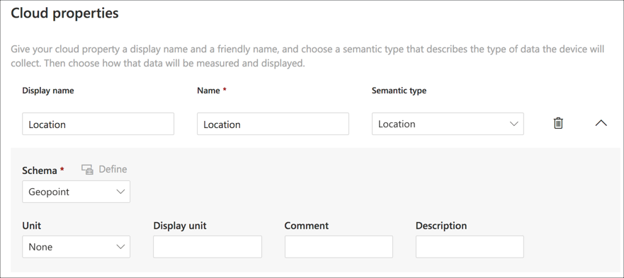

1. Select **Save** to save the cloud property

    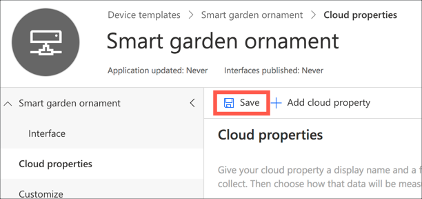

##### Add a view to visualize the temperature data from a device

1. Select **Views**

    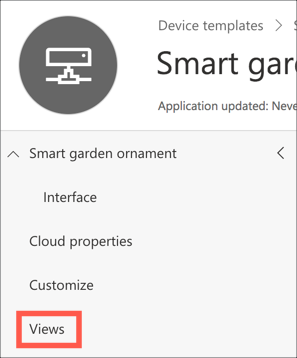

1. Select **Visualizing the device**

    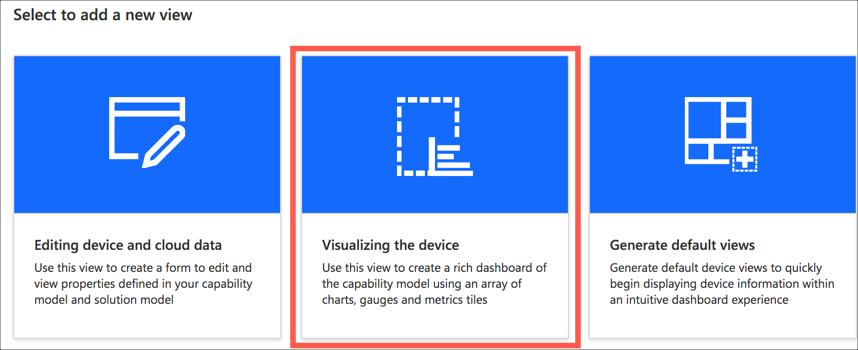

1. Set the *View name* to be `micro:bit data`

    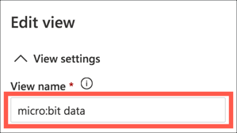

1. Drag *Temperature* in the *Telemetry* section onto the empty canvas. This will create a large time labelled *Temperature* and will default to showing a chart of the temperature over the last 30 minutes.

    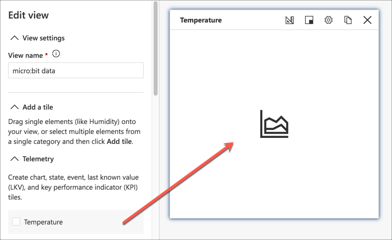

1. Select the cog icon to edit the properties for the graph and set the range to `Past 1 day`

    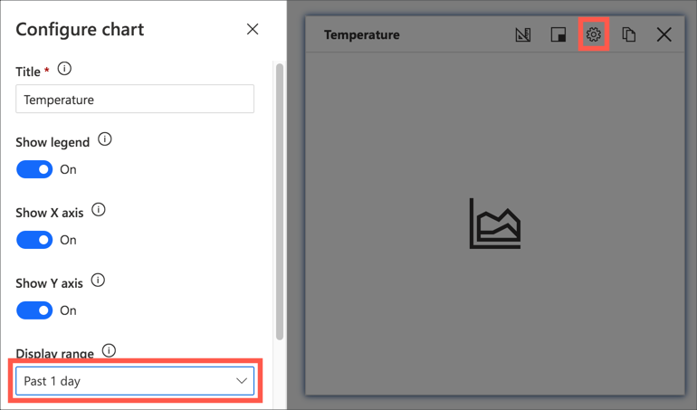

1. Select **Update** to save the changes to the temperature tile

    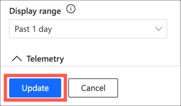

1. Select **Save** to save the view

    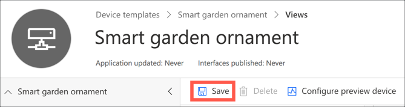

##### Add a view to set the location of a device

1. Select **Views**

    

1. Select **Editing device and cloud data**

    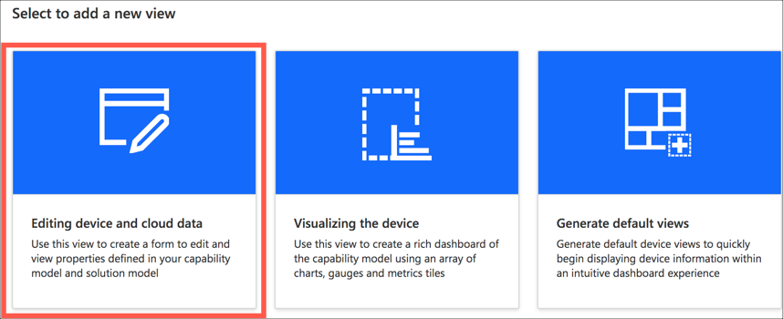

1. Set the *Form name* to `micro:bit location`

    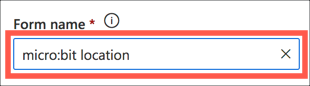

1. Drag *Location* in the *Cloud property* section to the canvas

    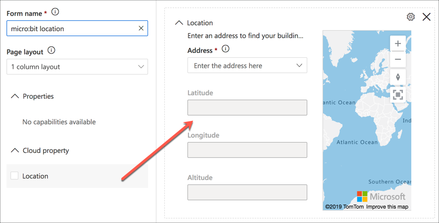

1. Select **Save** to save the view

    

### Publish the device template

Before the device template can be used, it has to be published. This locks down a version of the capability model, meaning you can't add or delete telemetry values. If you want to add telemetry, then you have to create a new version of the device template that copies the existing telemetry values and allows you to add more. This will be covered in a later day to add more sensor data.

To publish the device template:

1. Select **Publish** from the top menu

    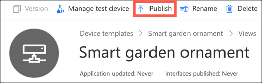

1. Select **Publish** from the publish dialog that appears

    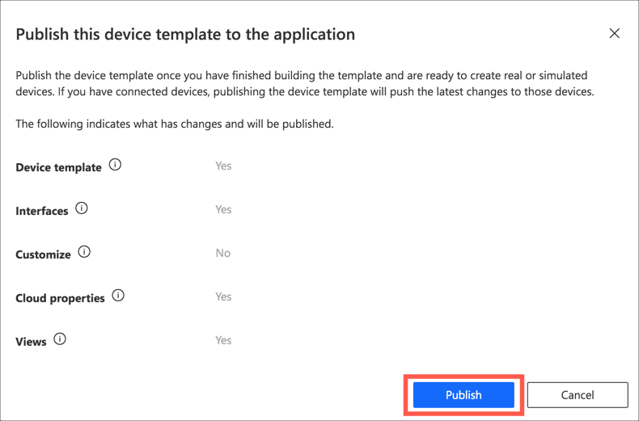

The device template will be published and can now be used to set up a device.

### Create a device

Now that you have a device template, you can use it to create a device in IoT Central. This is the IoT Central version of a smart garden ornament, showing the location of it and the current temperature. When the smart garden ornament sends data to IoT Cental, it will be a assigned to a specific IoT Central device.

#### Create the device using the device template

You'll start by creating a single device to get started, and in later days you can add more devices.

1. From the side bar menu, select **Devices**

    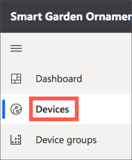

1. Select the *Smart garden ornament* template, then select **+New**

    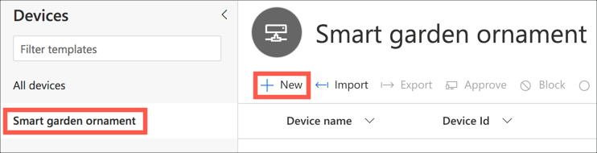

1. Fill in the fields for the device:

    1. Ensure the *Template type* is set to `Smart garden ornament`

    1. Name the device something that makes sense to you. For example, name devices after where they will be positioned, such as `Bird box outside Jim's window`

    1. Set the *Device ID*. This is the unique ID used to identify the device when sending data to IoT Central and can't have spaces or special characters except for hyphens. You can leave this as the default, or create a device ID similar to the name such as `jim-window-birdbox`.

    1. Ensure *Simulate this device* is set to **No**

1. Select **Create**

    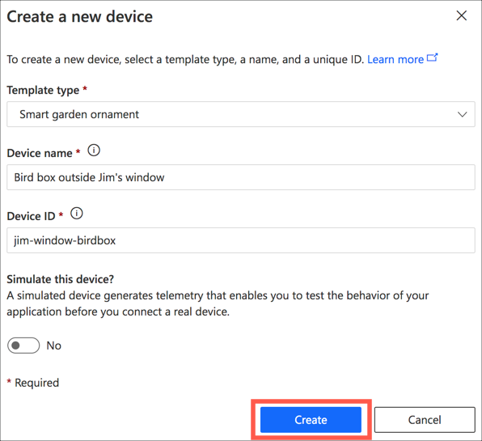

Take a note of this device ID.

#### Set the device location

Once the device has been created, it will appear in the devices list. You'll now be able to set the location.

1. Select the device from the list

    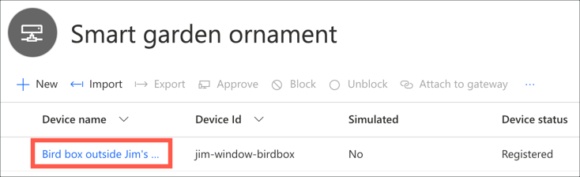

1. Select the **micro:bit location** tab

    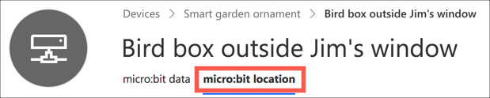

1. Search for the location of your smart garden ornament, or select it on the map. The search can find an address, and the map can be used to get a more precise location at that address. For example, if you had one positioned outside the South door of Microsoft Building 92 in Redmond, WA, USA you could:

    1. Search for `Microsoft Building 92`

        

    1. Select it when it comes up

        

    1. Zoom in and click on the map to move the pin to a more accurate position

        

1. Select **Save**

    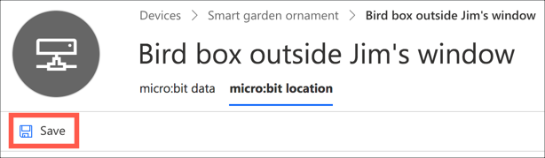

### Create a dashboard

You have a device configured, and a single view to see data for that device. The final part of this setup is to create a dashboard to allow you to see data from multiple smart garden ornaments at once.

#### Create a blank dashboard

1. From the side bar menu, select **Dashboard**

    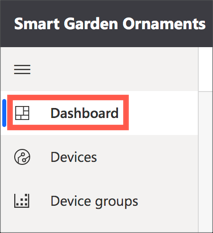

1. Select the **Edit** button on the top menu

    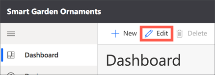

1. Name the dashboard `Smart garden ornaments`

    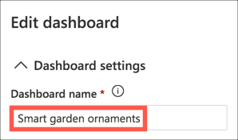

1. Delete all the items on the dashboard by selecting the ellipses button in the corner of each item then selecting **Delete**, or by selecting the **X** in the top corner, depending on what the item has available

    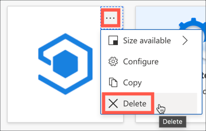

#### Add the temperature as a graph

1. In the *Add a tile* section, select the `Smart garden ornaments - all devices` device group

    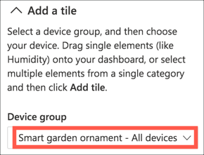

1. From the *Devices* section, check the device you created in the last step

    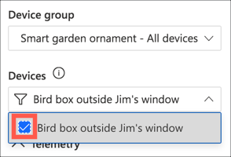

1. Check the box against **Temperature** in the *Telemetry* section

    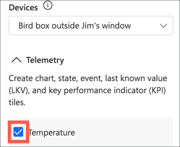

1. Select **Add tile**

    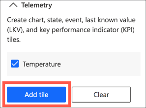

1. Select the cog in the Temperature tile on the dashboard and set the *Display range* to `Past 1 day`, the same as you did for the device view.

1. Tiles are sized based on a grid. The tile by default is 2x2, meaning it is 2 grid squares wide by two high. The graph will be easier to see if it is wider, so drag the bottom corner to make it wider.

1. Select **Update**

#### Add the device locations on a map

1. With the devices still selected, ensure **Temperature** is unselected, and select **Location** in the *Cloud property* section

    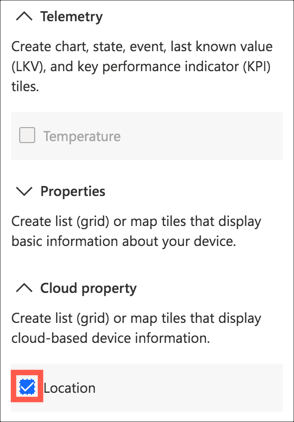

1. Select **Add tile**

#### Save the dashboard

1. Select **Save**

    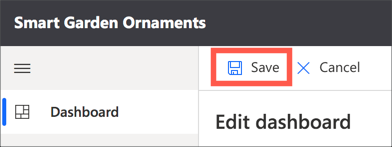

Once the dashboard is saved you'll see it with the two tiles. The temperature tile will  show **Waiting for data** as no data has been sent yet. The location tile will show the location you set on the first device on a map.

### Get the IoT Central app connection details

In tomorrows project you'll connect a Raspberry Pi to your IoT Central app. To do this you'll need 2 pieces of information - the ID scope which is an ID for the IoT central app, and one of the shared access signature (SAS) keys.

1. From the side bar menu, select **Administration** in the *App settings* section

    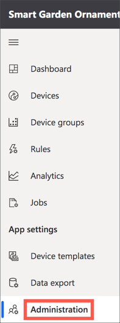

1. Select **Device connection**

    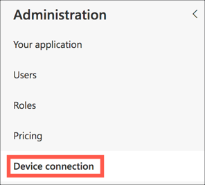

1. Take a note of the *ID scope* field. You can copy this with the copy button to the side of the value.

    

    > You should keep this value private as it allows people to access your IoT Central app, hence why mine is blurred in the image above

1. Select **View Keys** from the *SAS tokens on this app* section

    

1. Take a note of the *Primary key* field. You can copy this with the copy button to the side of the value.

    

    > You should keep this value private as it allows people to access your IoT Central app, hence why mine is blurred in the image above

1. Select **Close** to close the SAS keys dialog when you have the key

    

## Summary

You've completed todays project - setting up Azure IoT Central. [Tomorrow](./2-connect.md) you'll connect your Raspberry Pi to IoT Central and set up the micro:bit hub ready to gather data from your smart garden ornaments.
