# Day 2 - Connect to the cloud

> 
>
> **This day has sections that require someone confident in setting up and programming a Raspberry Pi, and sections requiring someone confident using block based programming on a BBC micro:bit. You will also need access to IoT Central to see the temperature data**

Yesterday you set up the cloud service to gather and show data from smart garden ornaments. Todays project is to set up the Raspberry Pi-based central hub that will send data to the cloud.

<!-- TODO - photo -->

This hub listens to messages that will be received via the radio on a micro:bit. These messages are then passed along a serial connection over USB to the Raspberry Pi, which will then send the messages to IoT Central.

The steps you'll take to do this are:

1. Set up the Raspberry Pi with an OS and internet connection
1. Install some Python code on the Pi to connect to IoT Central
1. Write some temporary code on the micro:bit to test the connection
1. Write some more code on the micro:bit to receive radio messages and send them to the Pi

Setting up the Pi is more advanced, so should be done by someone with more experience. Coding the micro:bit can be done by anyone with a little micro:bit coding experience.

> If you have never set up a Pi before, you can find some great guides on the [Raspberry Pi Help site](https://www.raspberrypi.org/help/).
>
> To learn mode about coding a micro:bit with Microsoft MakeCode, check out all the tutorials at [makecode.microbit.org](https://makecode.microbit.org).

## Prepare the hardware

> 
>
> **This section should be done by someone confident in setting up and programming a Raspberry Pi**

The hardware you'll need for this is:

* A Raspberry Pi with internet connectivity such as a Pi 4 or a Pi Zero W
* The appropriate power supply for the Pi
  * If you are using a Pi 4 you'll need a USB-C power supply
  * For all other Pis, you'll need a Micro USB power supply
* An SD Card
* A BBC micro:bit
* A USB cable to connect the micro:bit to the Pi
  * If you are using a Pi Zero W you will need a micro-USB to micro-USB cable (or an adapter to convert a micro-USB to USB cable)
  * For full size Pis you will need a micro-USB to USB cable
* A USB cable or adapter to connect the micro:bit to your PC or Mac. This might be the same cable as the one you will use to connect the micro:bit to your Pi, but you may need a different cable or adapter. For example if you are using a MacBook Pro or Surface Go with USB-C ports you will need a USB-C to USB adapter or a USB-C to micro-USB cable.
* A Mac, or PC running Windows or Linux, with an internet connection to program the Pi and the micro:bit
* Optionally a keyboard/mouse/monitor to control the Pi if you don't want to use VNC/SSH or other headless tools

### Set up the Raspberry Pi

You will need your Pi set up and running the latest version of Raspberry Pi OS, either Lite or the full version depending on your preference. My personal preference is to set up Raspberry Pi OS Lite and use Visual Studio Code as a remote development tool and terminal, but whatever works for you. This project doesn't need a GUI and runs from a terminal, so Raspberry Pi OS Lite will give a performance boost, especially making reboots faster.

> If you are using an existing device, make sure to upgrade the OS to the latest version, or image a new SD Card with the latest version and use that instead

You can find a guide to setting up your Pi for 'headless' development in the [Microsoft Raspberry Pi resources](https://github.com/microsoft/rpi-resources/tree/master/headless-setup). This setup allows you to use your Pi remotely from a PC or Mac without having to plug in a monitor/keyboard/mouse.

If you want to use Raspberry Pi OS Lite you can follow the same instructions, but leave out the VNC setup and just access the Pi over SSH. To image an SD Card, use the imager described in that doc, and for the OS select *Raspberry Pi OS (Other) -> Raspberry Pi OS (Lite)*.

To use Visual Studio Code as a remote development tool, check out the [Microsoft Raspberry Pi resources VS Code guide](https://github.com/microsoft/rpi-resources/tree/master/headless-setup).

Once your Pi is setup, access a terminal on the Pi either by connecting over SSH, Visual Studio Code remote development, or launching the Terminal directly on the Pi.

1. Run the following command to update the Pi's software to the latest version

    ```sh
    sudo apt update
    sudo apt full-upgrade
    ```

    Press `Y` when asked if you want to continue

1. Run the following command to install Python 3 virtual environments

    ```sh
    sudo apt install python3-venv
    ```

    Press `Y` when asked if you want to continue

1. Once upgraded, reboot your Pi

    ```sh
    sudo reboot
    ````

1. Give the Pi 30 seconds to reboot (longer if you are using the full Raspberry Pi OS instead of Lite), the reconnect.

### Upgrade the micro:bit to the latest version

To get the best out of your micro:bit, you should upgrade the on-board firmware to the latest version.

Do this by following these instructions in the [BBC micro:bit users guide](https://microbit.org/get-started/user-guide/firmware/).

## Code the Pi

> 
>
> **This section should be done by someone confident in setting up and programming a Raspberry Pi**

Rather than walk through writing the Pi code by hand, you can use an installer to install the source code, configure the Python packages needed, and add an entry to the devices CronTab to ensure the code is running every time the device reboots. You can view this `install.sh` script in the [pi-hub](./pi-hub) folder.

This script will:

* Create a folder in the Pi's home directory called `PiHub`
* Ask for the Azure IoT Central Scope ID and Key that you obtained when setting up IoT Central in the previous days project and write these to an environment file
* Download the required Python files
* Create a virtual environment
* Install the required Pip packages

The code that is installed will look for a micro:bit connected over USB, and make a serial connection, listening for data from the micro:bit. Once data is sent, it is decoded, and routed to Azure IoT Central.

### Install the code

To run this script to install the code:

1. From the Pi, run the following command:

    ```sh
    bash -c "$(curl -s -L https://github.com/jimbobbennett/smart-garden-ornaments/releases/download/v1.0/install.sh)"
    ```

1. When prompted, enter the Scope ID and primary key that you obtained in the previous step

The script will run and install and configure the relevant code and Pip packages.

> You can read more on how this code works in the [walkthrough of the Hub code architecture guide](../architecture-guides/hub-code-walkthrough.md).

### Configure the mappings

The micro:bits in the smart ornaments are only able to send radio messages with up to 19 characters. This means that they can't send things like their Azure IoT Central device ID, instead they have to use a code to send the smallest message possible, with the Pi looking up the code and translating it to a device ID.

Messages are sent using this format:

```sh
<device_code>:<data_type_code>:<data_value>
```

The `<device_code>` is used to look up which device send the message. The `<data_type_code>` is used to get the type of data, such as a temperature value. `<data_value>` is the actual data.

One example would be:

```sh
1:t:25
```

This would be from a device with code `1` which will be used to get the actual IoT Central device ID, and contain a temperature value of 25°C.

> You can read more on how this works in the [how telemetry is sent from a micro:bit to IoT Central architecture guide](../architecture-guides/how-telemetry-gets-to-iot-central.md).

The lookup is in the `mappings.py` file.

1. Open the `mappings.py` file from the `PiHub` folder in the Pi's home directory using your favorite text editor. For example Visual Studio Code via the remote development extension, or `nano` via SSH.

1. The code has two mappings, defined using Python dictionaries:

    ```sh
    value_types = {
        "t" : "temperature",
    }

    devices = {
        "1" : "device-1",
    }
    ```

    These map values received with a data type code of `t` to temperature measurements. They also include a mapping from a device code of `1` to a device ID of `device-1`.

1. Edit the `devices` dictionary to map `"1"` to the ID of the first device that you created in IoT Central, in quotes. For example, if you used the device ID `jim-window-birdbox`, make sure the line reads `"1" : "jim-window-birdbox",`

1. Save the file

## Code the micro:bit to test the connection

> 
>
> **This section requires someone confident in setting up and programming a Raspberry Pi, and someone confident using block based programming on a BBC micro:bit**

As an initial test, the micro:bit can be coded to send some dummy telemetry data for the first device. To program the micro:bit, you first need to connect it to your computer, then code it using MakeCode, a block, JavaScript and Python based editor.

The sample code to create dummy data will loop forever, sending coded telemetry over the micro:bit's serial connection.

### Code the micro:bit using MakeCode

You will need a browser to create code using MakeCode. Microsoft Edge is the recommended browser for this - it runs on Windows and macOS and is able to download code directly to your micro:bit from inside MakeCode. If you don't have Edge installed, you can download it from the [Edge installer page](https://www.microsoft.com/edge?WT.mc_id=smart_garden_ornaments-github-jabenn).

1. From your browser, head to [makecode.microbit.org](https://makecode.microbit.org/)

1. Select **+ New Project** from the *My Projects* section

    

1. Name the project `micro:bit hub`

    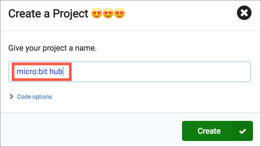

1. Select **Create**

    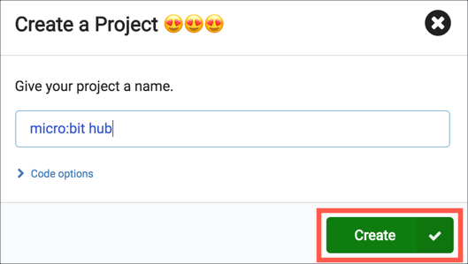

A new micro:bit project will be created that can be coded in Blocks, JavaScript or Python.

1. Expand the *Advanced* tab in the toolbox and select the **Serial** toolbox item

    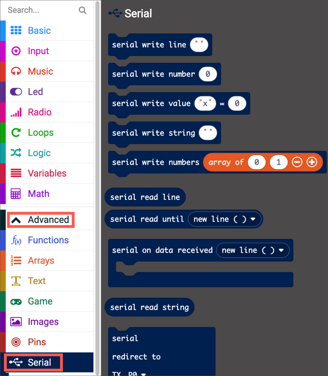

1. Drag **Serial write line `' '`** into the **forever** block on the canvas

    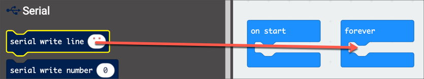

1. Select the `' '` variable to edit the value, and enter the text `1:t:25`

    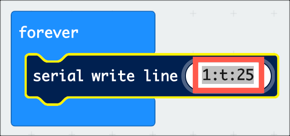

    This value is a coded way of saying that the data is from device 1 (which is mapped to the device that was set up in IoT Central), is temperature data and has a value of 25°C

This data should only be sent every few minutes as there are limits to how much data that IoT Central apps can receive using the lowest price tier, so a pause needs to be added to the **forever** block to delay the data send.

1. Select the **Basic** toolbox item

    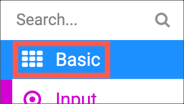

1. Drag a **Pause (ms) `100`** block into the **forever** block underneath the **Serial write line** block

    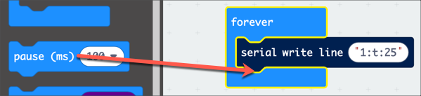

1. Select the `'100'` value to drop down a list of times, and select `5s` to pause for 5 seconds between data being sent.

    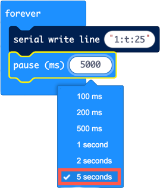

    > 5 seconds is still too often for this type of data, this is just used to make it quicker to see data when testing

1. If you want to see the output inside your browser, select **Show console Simulator**. This will show what gets sent over the serial connection.

    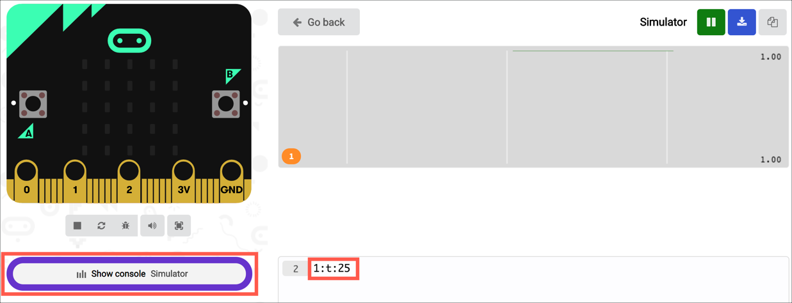

    Once you have verified the output, select **<- Go back** to return to the block editor

    

### Download the code onto the micro:bit

Once the code is ready, it needs to be copied to the micro:bit.

1. Plug your micro:bit into your computers USB port

1. If you are using the Edge browser, you can pair the browser to your micro:bit and download the code with one click

    1. Select the three ellipses on the MakeCode **Download** button

        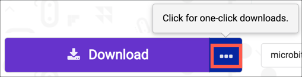

    1. Select **Pair device**

        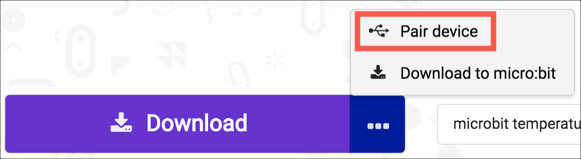

    1. From the *Pair device for one-click downloads* dialog, select **Pair device**

        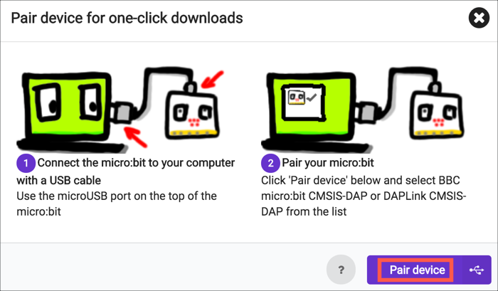

    1. Edge will show a dialog listing a device with a name such as `BBC micro:bit CMSIS-DAP` or `DAPLink CMSIS-DAP`. Select this and select **Connect**

        

    1. Select the **Download** button to download the code to your micro:bit

        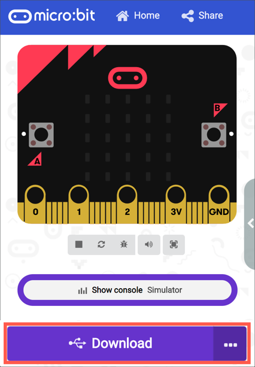

    MakeCode will show that the code is downloading, and the orange LED on the micro:bit will flash. Once the download has finished, the micro:bit will restart and start running your code/ MakeCode will return to the code screen, and the orange light will be on continuously.

    Once you have paired your device, you will be able to download new code by just selecting **Download**, you won't need to pair again.

1. If you are not using Edge you can download the code manually

    1. Select the **Download** button to download the code to your computer

        

        The code will be downloaded to your default Downloads folder

    1. You will see a popup when the download is complete

        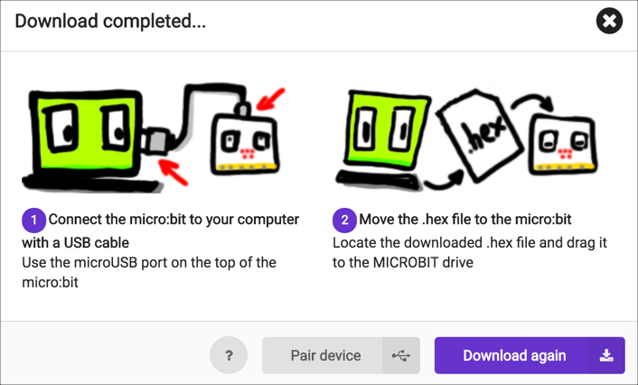

    1. Open Explorer (Windows) or Finder (macOS) and navigate to your Downloads folder

    1. You should see a drive called `MICROBIT`, this is the micro:bit

    1. Drag the `microbit-microbit-hub.hex` file to the `MICROBIT` drive

    The orange LED will flash as the code is copied, then when done the micro:bit will restart and start running your code. When the code is running, the orange LED will be on continuously.

### Connect the micro:bit to the Raspberry Pi

Unplug the micro:bit from your computer and plug it into one of the USB sockets on the Raspberry Pi with an appropriate cable or cable and adapter. The orange LED will flash as the device starts up, so wait till it is on continuously before starting the Pi code.

### Launch the Raspberry Pi code

The code needs to be running to be tested using a micro:bit. To launch it, use the following commands on the Pi:

1. Make sure you are in the code folder

    ```sh
    cd ~/PiHub
    ```

1. Activate the Python virtual environment

    ```sh
    source ./.venv/bin/activate
    ```

1. Run the code

    ```sh
    python app.py
    ```

The app will start up and do the following, outputting a log of what it's doing to the terminal.

1. Look for and connect to the micro:bit

    ```output
    Detecting micro:bit...
    Connected to micro:bit at /dev/ttyACM0
    ```

1. Wait for telemetry to arrive over the USB port

    ```output
    Waiting for telemetry...
    Received telemetry: 1:t:25
    Processing telemetry: 1:t:25
    ```

1. Check for an existing connection to IoT Central for the device. It won't find one the first time, so will create one and connect

    ```output
    Looking for connection to IoT Central for jim-window-birdbox
    No connection to IoT Central for jim-window-birdbox found, creating new connection...
    RegistrationStage(RequestAndResponseOperation): Op will transition into polling after interval 2.  Setting timer.
    Connection to IoT Central for jim-window-birdbox created!
    ```

1. Send the telemetry

    ```output
    Sending telemetry for device jim-window-birdbox : {"Temperature": 25.0} ...
    Telemetry for device jim-window-birdbox sent
    ```

Leave the application running for a few minutes to generate some data, then you can stop the application by pressing `ctrl+c`.

### View the telemetry in IoT Central

To see the telemetry in IoT Central and verify that the data has arrived, do the following

1. Open your IoT Central app

1. From the side bar menu select **Dashboard**

    

1. You will see a dashboard showing the temperature values on one tile, and the location on another tile

    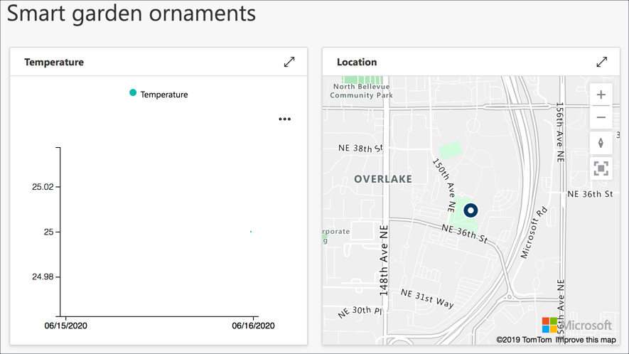

    > It can take a few minutes for the data to appear, so if you see **Waiting for data** wait a few more minutes.

1. The temperature tile will only show a small amount of data - the graph is for one day and you only have a few minutes worth of data. You can view the points in more detail by hovering your cursor over them.

    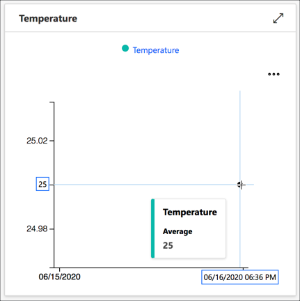

## Code the micro:bit

> 
>
> **This section requires someone confident using block based programming on a BBC micro:bit**

Once you've shown that the data is getting through the hub to the cloud, it's time to re-code the micro:bit to route messages from other devices. This micro:bit will listen for messages over the radio, and when one is received it will be written to the serial connection in exactly the same way as the dummy data was sent earlier.

The radio can be set to listen for different group numbers - this is a way to allow different sets of micro:bits to talk to each other without interfering with other groups. For example, all the micro:bits using group 1 would be able to send and receive messages to each other but wouldn't get messages sent by other micro:bits using group 2. To ensure all the smart garden ornaments can talk to each other, they need to use the same group.

### Write the code to forward radio messages to the serial port

1. Unplug your micro:bit from your Raspberry Pi and connect it to your PC or Mac

1. From your browser, make sure the MakeCode editor is still open. If not, head to [makecode.microbit.org](https://makecode.microbit.org/) and open the `micro:bit hub` project.

    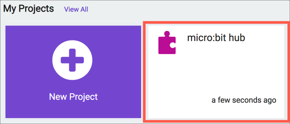

1. The blocks that created the dummy data need to be deleted. Drag the **serial write line `1:t:25`** block from the **forever** block onto the toolbox. The **pause (ms) `5000`** block will come with it.

    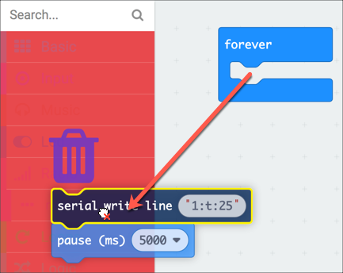

    The toolbox will show a trash can. Drop the blocks there to delete them.

1. Select the **Radio** toolbox item

    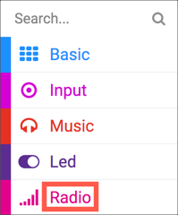

1. Drag **radio set group `1`** to the **on start** block

    

    You can leave the value as `1`, and this will be used for all smart garden ornaments.

    > If you live near others who are doing this project, or any projects with micro:bits and you don't want to share data then you will need to agree on using different group numbers

1. Select the **Radio** toolbox item again, and drag **on radio received `receivedString`** onto the canvas

    

    This block contains code that is run whenever the micro:bit receives a message over the radio containing a string (the radio can also listen for numbers). The `receivedString` variable will contain the contents of the message.

1. Expand the *Advanced* tab in the toolbox and select the **Serial** toolbox item

    

1. Drag **Serial write line `" "`** into the **on radio received `receivedString`** block on the canvas

    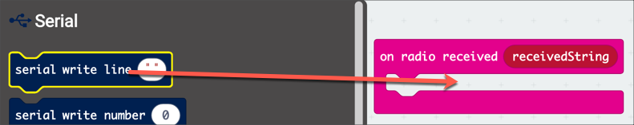

1. Drag the `receivedString` variable from the **on radio received `receivedString`** block to the `" "` variable being passed to the **serial write line `" "`** block.

    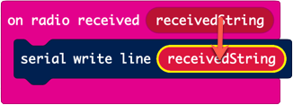

Your final program should look like this:

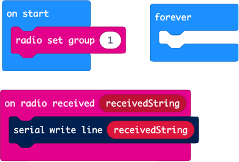

### Add LEDs to show the program is running

To help see what is happening, you can add visual feedback to indicate that the program is running, and when messages are received. For example, having a flashing heart icon to show a heartbeat indicating the program is running, and a duck icon whenever a message is received.

1. To set a heartbeat:

    1. Drag a **show icon** block to the **forever** block, selecting the heart icon
    1. Add by a **pause** block with a time of 100ms after the **show icon** block
    1. Add a **clear screen** block below the **pause** block
    1 Add another **pause** block below the **clear screen** block, and set the time to 5s

    This will show the heart for the length of the first pause, then have the screen clear for the second pause.

    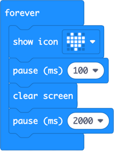

1. To show an image when a message is received:

    1. Add a **show icon** block to the **on radio received** block before the **serial write line** block, selecting the duck icon
    1. Add a **clear screen** block after the **serial write line** block

    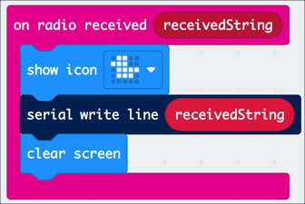

### Download the code to the micro:bit

Follow the instructions given above to download the code to the micro:bit, either using one-click downloads in Edge, or by downloading the hex file and copying to the micro:bit.

### Connect the micro:bit to the Pi

Now the micro:bit is programmed, it needs to be connected back to the Pi.

1. Ensure the code is not running on the Pi

1. Unplug the micro:bit from your computer

1. Plug the micro:bit in to the Pi

1. From the Pi, launch the app code

    ```sh
    python app.py
    ```

## Configure the Pi to launch the code on reboot

> 
>
> **This section should be done by someone confident in setting up and programming a Raspberry Pi**

The Pi hub code needs to be running all the time to send data. If you run the code over SSH it will only run as long as you are connected. If you launch the code from a terminal on the Pi connected to a keyboard/monitor/mouse, as soon as you unplug the Pi to move it elsewhere the code will stop.

The best thing to do is to have the code launched as soon as the Pi reboots, running in the background regardless of whatever else is running.

You can enable this using Cron. Cron is a scheduler, allowing you to run code or applications at certain times, days, whatever schedule you need. One option allows you to run code as soon as the device reboots.

You can use Cron to launch the Python code in a virtual environment once the Pi boots. Ideally after a short pause to make sure things like the WiFi is connected.

1. From the Pi, run the following code:

    ```sh
    sudo crontab -l > cron.tmp
    echo "@reboot sleep 60 && cd /home/pi/PiHub && /home/pi/PiHub/.venv/bin/python /home/pi/PiHub/app.py" >> cron.tmp
    sudo crontab cron.tmp
    rm cron.tmp
    ```

    This code takes a copy of the CronTab - a file that stores all the scheduled Cron jobs. It then adds an entry on reboot to sleep for 60 seconds to ensure WiFi is connected and the micro:bit has booted up, then runs the app code using Python.

1. After running this code, reboot the Pi

    ```sh
    sudo reboot
    ```

Once the Pi reboots, you can verify that the code is running by doing the following:

1. Wait 60 seconds after reboot to give the code time to launch

1. Run the following code to see what Python processes are running

    ```sh
    ps -ef | grep -i python
    ```

1. You should see multiple lines, with two running as root

    ```output
    root       382   346  0 22:16 ?        00:00:00 /bin/sh -c sleep 60 && cd /home/pi/PiHub && /home/pi/PiHub/.venv/bin/python /home/pi/PiHub/app.py
    root       671   382  0 22:17 ?        00:00:00 /home/pi/PiHub/.venv/bin/python /home/pi/PiHub/app.py
    ```

    The first line is the call from the Cron job, the second is the actual app.py file running under Python. Although there are two lines, the app is only running once.

## Summary

You've completed todays project - connecting the Pi Hub to Iot Central. [Tomorrow](./3-build-mesh.md) you'll program more micro:bits to create a mesh network of sensors to send temperature data to the cloud.
