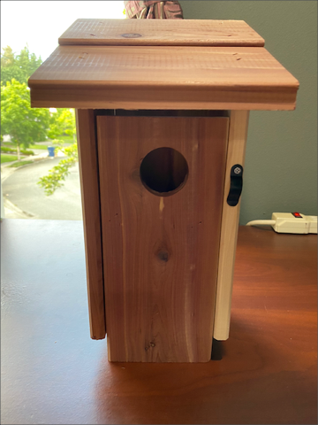
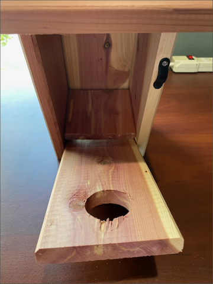
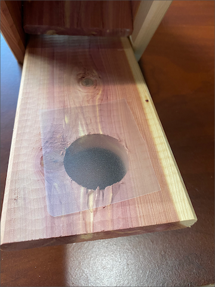
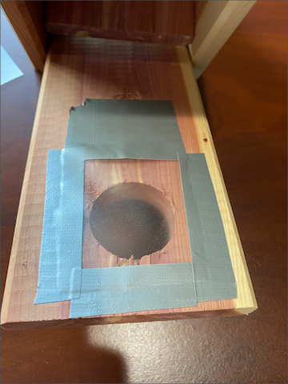
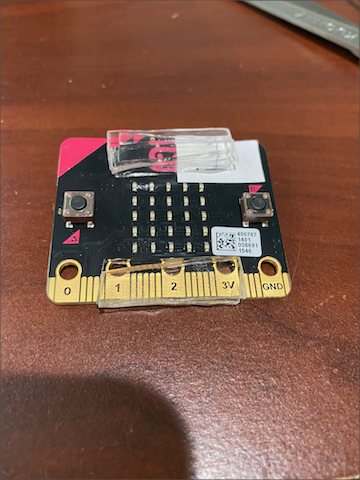
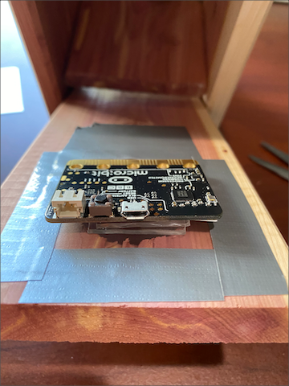
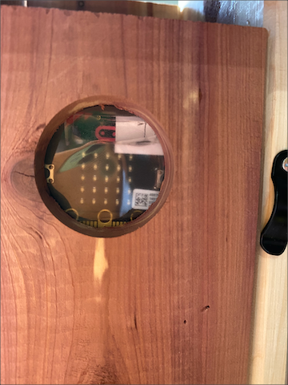
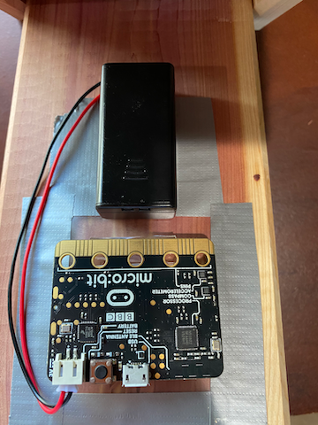

# Day 4 - Build a micro:bit powered smart garden ornament

> **This day is all hands on with construction, so will need to be done by someone confident with making skills. Children should have adult supervision**

Yesterday you programmed the mesh network to send temperature values between different micro:bits to the Hub, then on to IoT Central. Today you will get your make on and build smart garden ornaments powered by micro:bits. Once built, they will be positioned in locations that allow the mesh to work

The steps you'll take to do this are:

* Put the micro:bit in a garden ornament in the most optimal way
* Position the first garden ornament and configure the Hub location
* Position the smart garden ornaments to make sure the mesh is working well

## Build the first smart garden ornament

The instructions for this step are going to be vague, but this is because there are many ornaments you can add a micro:bit to, so it's impossible to provide all the instructions. The example given will be for a bird box, which is one of the simplest to use. Even if you are using a different ornament, read the bird box instructions as there are some important points to be aware of.

### Build a smart bird box

A bird box is a great first garden ornament to add a micro:bit to. They have plenty of space inside, with easy access to put the micro:bit and battery pack in. They also have holes for the birds to access, and these help the sensor gather temperature data, and can be used to see the LEDs to monitor the micro:bit if necessary. They are also waterproof which protects the micro:bit. They are usually made of thin wood which won't impact the signal too much.

The only downside is the possibility of a bird making a nest inside!

The bird box I'm using is a cheap, wooden bird box, nothing fancy. It has a hole in the front to let birds in, and the whole front can be opened to get access to the inside.

 

The first thing I did was to block off the hole to stop birds or water getting in. I used some transparent plastic cut to fit, and taped this over the hole on the inside using gaffer tape.

 

Next I mounted the micro:bit inside. It needs to be positioned so the LEDs are visible through the hole. The micro:bit can't sit directly on the inside front of the bird box as micro:bits have 2 buttons on their front. I used 3 layers of thick double-sided re-usable mounting tape across the top and bottom of the micro:bit to make it fit, then mounted this on the plastic so the LEDs were visible. The advantage of the re-usable tape is I can remove the micro:bit to reprogram it when necessary.

 

Finally, I fixed the battery pack below the micro:bit with some double-sided mounting tape. I positioned it so the top can still be opened to replace the batteries

## Position the first ornament and the Hub

The mesh network allows messages to be sent all around the mesh to ensure they reach the Hub micro:bit. To make this work, there has to be at least one micro:bit close enough to the hub for messages to get through. This means careful thought has to be given to where the first smart garden ornament is, as well as where the Hub is positioned.

You also need to consider the data yo are gathering. In the first instance you are gathering temperature, so what temperature are you interested in? Temperature in direct sunlight, in the shade, under a porch, in a swimming pool...

> Make sure you have permission to place the smart garden ornaments in the locations you want to use!

### Position the Hub

The Hub is usually the best one to position first, as it needs access to power and internet. Try to find the most optimal position by considering the following:

* Power
* Internet
* Distance to where the first smart garden ornament can be

The Hub needs to be close enough to the right form of power. A Raspberry Pi 4 needs USB-C power, whereas other Pis use micro-USB. You can use long USB cables to give you more control over positioning - for example the ones used for smart door bells or security devices come in lengths of up to 10M. These are usually thin so can be run under doors.

You can use a battery pack if you prefer, especially if you are using a Pi Zero with a low power draw. Make sure you can easily access and charge the battery pack when required, and that it is a very high capacity power pack - the freebies given away at conference will be drained in less than a day. There are a whole load of tips on reducing your Pi's power usage on [Jeff Geerlings blog](https://www.jeffgeerling.com/blogs/jeff-geerling/raspberry-pi-zero-power).

To keep the distance to the garden ornaments down, you might want to put the Hub outside. If you do this, you need to make sure any power connections are waterproof, and the Hub needs to be somewhere where it can be kept dry. This can be with a plastic bag if necessary. Be aware that a nice looking Raspberry Pi sitting outside your house may encourage a passing thief to swipe it, so make sure it is out of sight!

Another option is to put the Hub with a line of sight to the position of the first smart garden ornament through a window. Having anything between micro:bits will reduce the signal, but glass blocks less of the signal than wood or bricks.

Internet should be less of a problem if you are using WiFi - the Hub should be positioned somewhere where it can get a good WiFi signal. If you are using wired internet then you need to ensure the Hub is close enough to your router to run a cable.

<!-- TODO - pictures -->

### Position the ornament

Once the Hub is positioned, you can position the first smart garden ornament. Pick a location that can gather good temperature data - for example if you care about the temperature in the shade, make sure it is positioned in the shade.

This location also needs to be close enough to the Hub to get messages through. You can test the messages by positioning the smart garden ornament and checking the LEDs on the Hub micro:bit. If a message is received it will flash a duck icon. Rather than watch for 10 minutes to check the message, reset the micro:bit in the garden ornament to send a message immediately and have an assistant check the Hub.

You also need easy access to be able to change batteries! A micro:bit with a good set of batteries will last up to a week, so you will need to be able to change batteries at least once a week.

> Don't forget to dispose of batteries correctly at a battery recycling location

For example, you could have the Hub next to a window inside the house with line of sight to a tree, and a smart bird box in the tree.

<!-- TODO - pictures -->

> If the ideal position is not close enough to the Hub, you can always add another micro:bit to the mesh. Put it in a plastic bag to make it waterproof and position between your Hub and smart garden ornament.

## Position the rest of the ornaments

Once one smart garden ornament is in place, you can position the rest. Make sure they are close enough to at least one other smart garden ornament to ensure the messages get on to the mesh. For example, if you have a bird box in a tree on one side of the road, you can add another on the other side of the road.

<!-- TODO - pictures -->

> If the ideal position is not close enough to the Hub, you can always add another micro:bit to the mesh. Put it in a plastic bag to make it waterproof and position between your Hub and smart garden ornament.

## Ideas for different smart garden ornaments

The first example described here was a smart bird box. Some other things you can build include smart gnomes and smart swimming pool temperature monitor. Also try to think of as many ideas as possible (and fork this repo and raise a PR so you can share your ideas with the world).

### Smart Gnome

Smart garden gnomes are a fun addition to any garden. The problem comes getting the micro:bit inside.

Make sure you choose a gnome that is hollow and is made of a soft material you can cut if there isn't a hole. You don't want to be breaking an expensive resin gnome just to get the bits inside. A gnome with a wheelbarrow can also work - just put the micro:bit and battery inside a waterproof bag inside the wheelbarrow. Be careful if this is publicly visible though, you don't want someone to swipe it whilst walking past.

If you are putting the micro:bit inside, check the signal strength - a thick concrete statue will limit the radio signal more than a thin plastic one. If there is a hole in the bottom to put the micro:bit in, be aware that it may end up resting on the ground, so may get wet. A waterproof bag will help.

### Pool monitor

If you have a pool at home (lucky you!) then it's good to know the water temperature before you jump right in. There are some quirks with detecting water temperature to be aware of to build a water temperature sensor.

The micro:bit is not waterproof, nor is the battery, so you'll need to put everything in a waterproof container. This container needs to be heavy enough to hold the micro:bit under water, but also allow the temperature to penetrate through. A ziplock back will work wonders, just make sure there's no air inside and seal the top with a hot glue gun or a good plastic clip. Another option is a waterproof external temperature sensor, such as the [Waterproof DS18B20 Digital temperature sensor](https://www.adafruit.com/product/381).

Water is very good at absorbing radio signals. You'll need to make sure that the micro:bit is close to the sides of the pool to help the signal get through. You might also want to add another micro:bit nearby to help re-send the message to the mesh. Again, an external temperature sensor helps with this as the micro:bit can stay out of the pool and in the line of sight of other micro:bits in the mesh.

People are also a consideration. If the pool has kids splashing around in it they could easily tread on the micro:bit, causing it to break or even in injury. Make sure its out of the pool before fun commences.

## Summary

Today you built and positioned your smart garden ornaments. [Tomorrow](./5-add-more-sensors.md) you will add additional sensors to gather more data.
